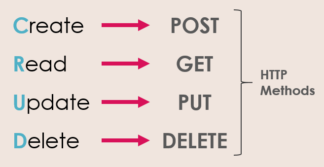
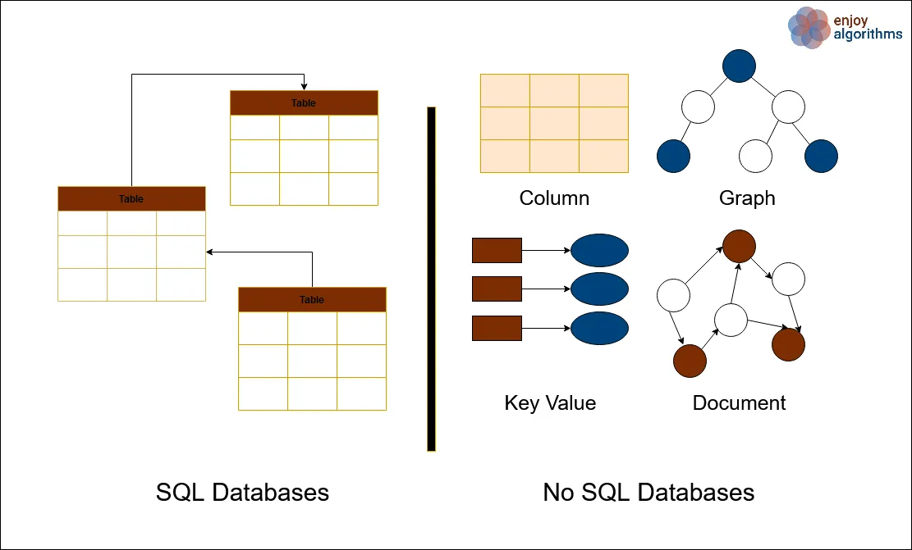
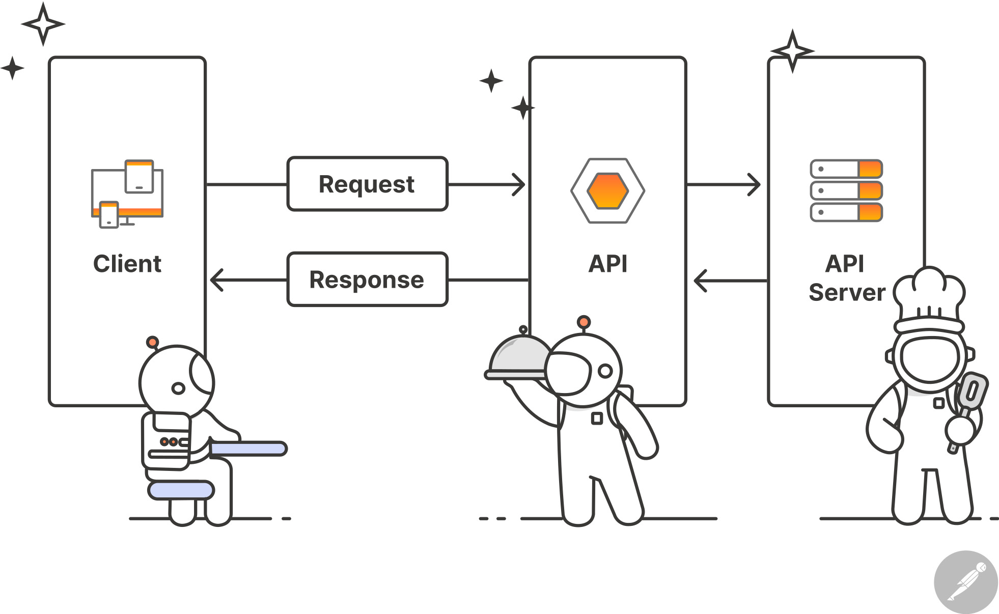

# Cuestiones teóricas

## 1. ¿Para qué usamos Clases en Python?


Una **clase** es una estructura que permite definir objetos que poseen atributos y métodos, tal y como se puede ver en la imagen de arriba. Esta actúa como una plantilla para crear un objeto determinado, que es una **instancia** de esa clase. Las clases constituyen el núcleo de la **programación orientada a objetos** (OOP, por sus siglas en inglés) Para construir una clase se debe utilizar la palabra clave **class** seguida del nombre de la clase y dos puntos (:). Por ejemplo, considere el siguiente bloque de código y su salida:
```python
# Definicion de clase
class Cliente:
    def __init__(self, nombre, apellido, deuda):
        self.nombre = nombre
        self.apellido = apellido
        self.deuda = deuda


cliente1 = Cliente('Jorge', 'Dominguez', 0) # Instanciacion de clase
print(cliente1.nombre)
print(cliente1.apellido)
print(cliente1.deuda)
```
```python
Jorge
Dominguez
0
```
Aquí se define la clase **Cliente** cuyos atributos son **nombre**, **apellido** y **deuda**. La variable **cliente1** es una instancia de la clase **Cliente** con los atributos **'Jorge'**, **'Dominguez'** y **0**.  Por ahora no se va a mencionar porqué se debe utilizar el constructor `__init__`, ya que es objeto de la siguiente pregunta. 

Para acceder a los atributos y métodos de una instancia simplemente se escribe el nombre de la instancia seguida de un punto (.) y el nombre del atributo o método al cual se desea acceder, tal y como se puede ver en las líneas **print** del ejemplo. De la misma manera, también se pueden asignar nuevos valores a los atributos tal y como se puede en el siguiente código y su correspondiente salida:
```python
cliente1.nombre = 'Paco'
cliente1.apellido = 'Martinez'
cliente1.deuda = 3000
print(cliente1.nombre)
print(cliente1.apellido)
print(cliente1.deuda)
```
```python
Paco
Martinez
3000
``` 
A los atributos de la instancia **cliente1**, **'Jorge'**, **'Dominguez'** y **0**, se le han asignado los valores nuevos **'Paco'**, **'Martinez'** y **3000**.

Además de los atributos, también es posible establecer uno o varios métodos dentro de una clase para realizar operaciones sobre los objetos de esta clase. De esta manera, los objetos creados pueden llamar a los mencionados métodos. Siguiendo con el ejemplo anterior, en el siguiente bloque de código se define el método **nueva_factura** a la clase **Cliente**, que suma el número **cuantia_factura** al atributo **deuda**:
```python
# Definicion de clase
class Cliente:
    def __init__(self, nombre, apellido, deuda):
        self.nombre = nombre
        self.apellido = apellido
        self.deuda = deuda

    def nueva_factura(self, cuantia_factura):
        self.deuda += cuantia_factura 


cliente1 = Cliente('Jorge', 'Dominguez', 0) # Instanciacion de clase
print(cliente1.deuda)

cliente1.nueva_factura(500)
print(cliente1.deuda)
```
```python
0
500
```
Después de la instanciación se accede al método **nueva_factura** con el atributo **cuantia_factura** igual a 500. Esto hace que el atributo **deuda** pase de 0 a 500, tal y como se puede ver en la salida del código.

Algunas ventajas que presenta el uso de las clases son:

- **Encapsulación**: se pueden agrupar datos y funciones relacionadas en una única clase.
- **Modularidad y mantenibilidad**: facilita la estructuración y legibilidad del código así como su mantenimiento.
- **Polimorfismo**: se pueden definir métodos con el mismo nombre pero con implementaciones diferentes en distintas clases (tal y como se discute en la pregunta 7 de este documento).
- **Herencia**: se pueden crear nuevas clases basadas en clases existentes, favoreciendo la reutilización de código (véase la pregunta 7).


A la hora de asignar un nombre a una clase suele ser una buena práctica utilizar la convención **Pascal Case**, es decir, la primera letra de cada palabra del nombre de la clase debe ir en mayúscula. Por otro lado, el nombre de las instancias debe ir en minúsculas. 


## 2. ¿Qué método se ejecuta automáticamente cuando se crea una instancia de una clase?

Un **método** de Python es una función que se define dentro de una clase y opera sobre las instancias creadas a partir de esa clase. Estos permiten la manipulación de los datos proporcionados a una instancia u objeto e incorporan funcionalidades específicas, generalmente relacionadas con la clase a la que pertenecen.

Algunas características de los métodos son las siguientes:

 - **Asociados a una clase**: los métodos se definen dentro de una clase y solo pueden realizar manipulaciones sobre sus instancias o sobre la propia clase.
 - **Invocación a través de una instancia o de la clase**: en función del método,  este se puede llamar desde una instancia u operar sobre la clase.
 - **Modificar un objeto**: los métodos pueden acceder y modificar los atributos de la instancia.

En Python existen principalmente tres tipos de métodos: **métodos de instancia**, **métodos de clase** y **métodos estáticos**, que se explicarán con más detalle a continuación.

###  Métodos de Instancia
Los métodos de instancia son los más comunes. Estos se definen utilizando la palabra clave `def` seguida del nombre del método y toma `self` como primer parámetro. Los métodos de instancia operan sobre una instancia u objeto de la clase a la que pertenecen. A través del argumento `self`, se puede acceder y modificar los atributos de la instancia. En el siguiente bloque de código se muestra un ejemplo de un método de instancia y su correspondiente salida:

```python
class Cliente:
    def __init__(self, nombre, apellido, deuda):
        self.nombre = nombre
        self.apellido = apellido
        self.deuda = deuda

    def nueva_factura(self, cuantia_factura):
        self.deuda += cuantia_factura 


cliente1 = Cliente('Jorge', 'Dominguez', 0) # Instanciacion de clase
print(cliente1.deuda)

cliente1.nueva_factura(500)
print(cliente1.deuda)
```
```python
0
500
```

Aquí se ha definido la clase **Cliente** así como el método **nueva_factura**. Este método utiliza el argumento `self` para acceder al atributo **deuda** de la instancia y le suma el argumento **cuantia_factura**, tal y como se puede ver en la salida.

### Métodos de Clase

Los métodos de clase, a diferencia de los métodos de instancia, operan sobre la clase en lugar de sobre una instancia. Se definen con la palabra clave `@classmethod` seguida de un salto de línea, la palabra `def` y el nombre del método y toma `cls` como primer argumento en lugar de `self`. En el siguiente bloque de código se muestra un ejemplo de un método de clase y su respectiva salida:

```python
class Cliente:
    
    cantidad_clientes = 0 # Atributo de clase
    
    def __init__(self, nombre, apellido, deuda):
        self.nombre = nombre
        self.apellido = apellido
        self.deuda = deuda
        Cliente.cantidad_clientes += 1

    def nueva_factura(self, cuantia_factura):
        self.deuda += cuantia_factura 

    @classmethod
    def numero_clientes(cls):
        return (f'El número de clientes es: {cls.cantidad_clientes}')
        


cliente1 = Cliente('Jorge', 'Dominguez', 0) # Instanciacion de clase
cliente2 = Cliente('Roberto', 'Álvarez', 300) 

print(Cliente.numero_clientes())
```
```
El número de clientes es: 2
```
En este ejemplo se ha definido el método de clase **numero_clientes**, que cuenta el número de objetos que se han creado con la clase **Cliente**. Este método accede al atributo de clase **numero_clientes** sin necesidad de hacer una instanciación.

### Métodos Estáticos 

Los métodos estáticos son métodos independientes de la instancia y de la clase. Estos se asemejan a funciones corrientes dentro de la clase y se definen con la palabra clave `@staticmethod` seguida de una salto de línea, la palabra `def`, el nombre del método y los argumentos de entrada. En el siguiente bloque de código se define un método estático así como su salida:

```python
class OperacionesBasicas:
    @staticmethod
    def suma(num_1, num_2):
        return(num_1 + num_2)

    @staticmethod
    def resta(num_1, num_2):
        return(num_1 - num_2)

    @staticmethod
    def multiplicacion(num_1, num_2):
        return(num_1 * num_2)

    @staticmethod
    def division(num_1, num_2):
        return(num_1 / num_2)

print(OperacionesBasicas.suma(1, 2))
```
```python
3
```
En este ejemplo se ha definido la clase **OperacionesBasicas** junto con los métodos estáticos **suma**, **resta**, **multiplicacion** y **division**. Estos métodos no acceden a ningún atributo de la clase o instancia, de manera que se pueden usar sin crear un objeto.

En definitiva, los métodos de Python permiten estructurar el código de una forma organizada dentro de clases. Dependiendo del tipo de uso, se puede elegir entre los métodos de instancia, de clase o estáticos para implementar diferentes funciones.

Dicho esto, el método que se ejecuta automáticamente cuando se crea una instancia de una clase en Python es el método `__init__`. Este método es un método especial de las clases de Python, concretamente un método dunder (véase la pregunta 8 de este documento), cuyo objetivo fundamental es inicializar los atributos de una instanciación.

Algunas características de este constructor son:
 - Se ejecuta inmediatamente después de crear un objeto
 - No devuelve ningún dato
 - Es opcional, aunque es muy común declararlo 

Por ejemplo, considere el siguiente bloque de código y su correspondiente salida:
```python
class Coche:
    def __init__(self, marca, modelo):
        self.marca = marca
        self.modelo = modelo

coche1 = Coche('Honda', 'Accord')
print(coche1.marca)
print(coche1.modelo)
```
```python
Honda
Accord
```
En este código se ha definido la clase **Coche** cuyos atributos son **marca** y **modelo**. Al definir el objeto **coche1** el constructor `__init__` asigna al atributo **marca** el valor **'Honda'** y al atributo **modelo** el valor **'Accord'**.

## 3. ¿Cuáles son los tres verbos de API?



Cuando se trabaja con APIs (para saber qué es una API véase la pregunta 5 de este documento) es fundamental el conocimiento de los verbos o métodos que emplea el protocolo HTTP. Estos verbos especifican la acción que el cliente (aplicación o navegador) desea realizar en el servidor. Existen diferentes verbos, cada uno de los cuales ejecuta una acción distinta. Los más utilizados son los siguientes:

 - **GET**: este método es utilizado para obtener información almacenada en el servidor. Las operaciones que realiza son única y exclusivamente de lectura, de manera que no cambian la información del servidor.
 - **POST**: este verbo se utiliza para enviar datos al servidor. Las operaciones que realiza son de escritura, por lo que se cambia el estado del servidor.
 - **PUT**: este método es utilizado para actualizar información existente en el servidor.
 - **DELETE**: este verbo se utiliza para borrar información del servidor, por lo que hay que utilizarlo con sumo cuidado. 

En la figura de arriba se resume qué es lo que hace cada uno de estos verbos, para facilitar su aprendizaje.

## 4. ¿Es MongoDB una base de datos SQL o NoSQL? 

Una **base de datos** es un sistema concebido para recopilar y organizar información de una manera lógicamente estructurada y eficiente. Esta se utiliza en casi todos los ámbitos de la tecnología, desde aplicaciones móviles hasta sistemas empresariales. Algunas de sus características son las siguientes:

- **Accesibilidad**: permite acceder a la información de forma rápida, eficiente y precisa.  
 -  **Almacenamiento estructurado**: los datos están estructurados de manera lógica.  
- **Seguridad**: puede incorporar permisos y procesos de autenticación que protegen lo datos.
- **Escalabilidad**: puede manejar grandes volúmenes de datos.


Las bases de datos se dividen fundamentalmente en dos grandes grupos: **bases de datos SQL o relacionales** y **bases de datos NoSQL o no relacionales**, que se explicarán con más detalle a continuación.  

### Bases de datos SQL o relacionales

Las **bases de datos SQL** (acrónimo de Structured Query Language) organizan los datos en tablas estructuradas (parecido a una hoja de Excel) e interconectadas. Este tipo de bases están compuestas por esquemas y tablas:
 - Los **esquemas** definen la estructura de las tablas, las variables, el tipo de datos, el rango de los datos así como su relación.
 - Las **tablas** están compuestas por filas y columnas que contienen valores individuales para cada uno de los parámetros.

Estas bases de datos se basan en el **modelo relacional**, propuesto por el ingeniero informático Edgar F. Codd en 1970 mientras trabajaba para IBM. En 1974 se desarrolló el lenguaje **SQL**, que pasó a ser el lenguaje estándar para interactuar con bases de datos relacionales. Aún hoy este lenguaje sigue siendo uno de los más utilizado para este tipo de bases de datos.

Las bases de datos SQL presentan las siguientes características:

- **Estructura rígida**: los datos se almacenan en tablas con un esquema inamovible.  
- **Lenguaje de consulta estructurado (o SQL)**: este lenguaje se usa para consultar y manipular datos de manera eficiente.  
- **Claves primarias y foráneas**: permiten relacionar datos entre distintas tablas y no solo dentro de una misma tabla.

### Bases de datos NoSQL o no relacionales 

Las **bases de datos NoSQL** (acrónimo de Not Only SQL) organizan los datos utilizando **esquemas dinámicos**, es decir, cada una de las filas de una tabla puede contener campos o parámetros distintos. Esto difiere de las bases de datos SQL, que utilizan esquemas estáticos. 

Las bases de datos NoSQL se inventaron a finales de la década de 1990 y principios de la década de 2000, siendo su principal cometido la manipulación de datos no estructurados o que están semiestructurados y permitir una alta escalabilidad y flexibilidad. Son muy utilizadas en aplicaciones modernas como las redes sociales, el big data y las aplicaciones en la nube.  

Las características que presentan las bases de datos no relacionales son las siguientes:

- **Almacenamiento flexible**: no precisa de esquemas fijos.   
- **Velocidad y eficiencia**: resulta ideal para trabajar con grandes volúmenes de datos.  
- **Escalabilidad horizontal**: se pueden agregar servidores fácilmente. 

Habiendo visto los dos grandes grupos de bases de datos resulta pertinente plantear la siguiente cuestión: ¿cuándo se debe utilizar cada una de ellas? Las bases de datos SQL se utilizan cuando los datos que se desean manejar presentan estructura y relaciones bien definidas. Son muy usadas por bancos. Por otro lado, las bases de datos NoSQL se utilizan cuando los datos a manipular no están estructurados o están semiestructurados. Son muy usadas por redes sociales, big data, aplicaciones en la nube, etc.

En la siguiente imagen se resumen los aspectos más importantes de las bases de datos SQL y NoSQL.



Atendiendo a las características de ambos tipos de bases de datos y teniendo en cuenta las características de MongoDB se puede concluir que **MongoDB** es una base de datos **NoSQL**. 

## 5. ¿Qué es una API?

Una **API** (acrónimo de Application Programming Interface) es un conjunto de reglas o protocolos que permiten la comunicación entre distintos componentes de software. Para explicar cómo funciona una API considere una aplicación con una arquitectura de microservicios que tiene dos componentes, una base de datos y un sistema de autenticación. Cuando se meten el usuario y la contraseña, el sistema de autenticación envía una solicitud a la API. Esta procesa la solicitud y la envía a la base de datos. La base de datos procesa la petición y devuelve una respuesta permitiendo o no la autenticación. Este proceso está resumido en la siguiente imagen:



Según su arquitectura, existen distintos tipos de APIs:

 - **APIs REST** (acrónimo de Representational State Transfer): están basadas en el protocolo HTTP. Utilizan métodos como `GET`, `POST`, `PUT` y `DELETE`, ya explicados en la pregunta 3 de este documento, son rápidas y escalables. 
 - **APIs SOAP** (acrónimo de Simple Object Access Protocol): están basadas en XML, son independientes del protocolo y son más seguras y estructuradas pero más lentas.
 - **APIs GraphQL**: permiten a los clientes solicitar única y exclusivamente los datos que necesitan, evitando el exceso de información o la falta de datos en las respuestas.
 - **APIs WebSockets**: permiten una conexión bidireccional y persistente entre el cliente y el servidor. A diferencia del protocolo HTTP (en el que el cliente solicita datos y el servidor responde), con WebSockets ambos pueden enviarse mensajes en cualquier momento, sin necesidad de abrir nuevas conexiones. Son muy usadas para chats en línea o videojuegos.

Las APIs presentan una multitud de usos y están presentes en nuestro día a día. Por ejemplo:

- **Redes sociales**: Facebook, Twitter e Instagram tienen APIs para obtener publicaciones, enviar mensajes, etc.  
- **Pagos en línea**: PayPal, Stripe y muchos bancos permiten integrar pagos en el comercio electrónico.  
- **Plataformas de streaming**: Spotify, Netflix, Disney Plus y HBO Max tienen APIs para acceder a contenido.  
- **Asistentes virtuales**: Alexa, Google Assistant así como Cortana usan APIs para responder preguntas.  
- **Mapas y geolocalización**: la API de Google Maps permite mostrar mapas en aplicaciones y páginas web.  

Algunos beneficios derivados del uso de APIs son:

 - **Automatización**: permiten que los sistemas se comuniquen sin intervención manual.  
 - **Escalabilidad**: facilitan la integración con múltiples servicios, como en aplicaciones de microservicios.  
- **Estandarización**: usan protocolos estándar como HTTP y JSON.  
- **Eficiencia**: se reducen los tiempos de desarrollo al reutilizar servicios ya existentes.  

Sin embargo, el uso de APIs también presenta algunos inconvenientes:

 - **Seguridad**: suelen ser puntos de vulnerabilidad de una aplicación.
 - **Gestión y Mantenimiento**: cuando una aplicación depende de varias APIs, la gestión y el **mantenimiento** se vuelve más intrincado.
 - **Dependencia**: si una aplicación depende de una API desarrollada por un tercero, si el servicio tiene fallos o caídas, la aplicación puede verse afectada.

En conclusión, una **API** constituye una herramienta esencial en el desarrollo de software moderno. Nada de lo que se utiliza hoy en día sería posible sin esta herramienta. Permite que diferentes aplicaciones se comuniquen entre sí de manera eficiente y escalable. Hoy en día, casi todas las aplicaciones dependen de APIs para ofrecer todo tipo de funcionalidades.

## 6. ¿Qué es Postman?

Postman es un software orientado al diseño, desarrollo y testeo de **API**s (para saber qué es una API consulte la pregunta 5 de este mismo documento). Postman simplifica cada una de las etapas del ciclo de vida de una API a la par que agiliza la colaboración para crear APIs mejores y en menos tiempo. Entre sus características destacan:

 - **Repositorio de APIs**: permite almacenar y gestionar las especificaciones de las APIs, la documentación, las métricas, los resultados de las pruebas, etc.
 - **Herramientas**: contiene un conjunto de herramientas que permiten acelerar el proceso de creación de una API, desde las etapas más tempranas hasta el producto final.
 - **Gobernanza**: fomenta la colaboración entre los equipos de desarrollo y de diseño de la API.
 - **Espacios de trabajo**: permite organizar el trabajo de la API y la colaboración con distintos desarrolladores. 
 - **Integración**: está integrado con las herramientas más importantes de desarrollo de software.

 Es una herramienta extensamente utilizada por desarrolladores, testers y equipos para:

- Diseñar, construir y documentar APIs.
- Colaborar en equipos de desarrollo.
- Enviar solicitudes HTTP a APIs (GET, POST, PUT, DELETE, etc.).
- Probar APIs mediante la creación de tests automatizados.
- Monitorear el rendimiento de APIs.

## 7. ¿Qué es el polimorfismo?

La **herencia** es un proceso de la programación orientada a objetos mediante el que se puede crear una clase hija partiendo de una clase padre que comparte sus métodos y atributos. En Python, para especificar que una clase se hereda de otra se debe escribir la palabra clave **class** seguida del nombre de la clase hija y el nombre de la clase padre entre paréntesis. En esta clase hija se pueden definir nuevos métodos y atributos pero, además, se pueden sobrescribir métodos y atributos ya existentes, lo que da lugar al **polimorfismo**. Un polimorfismo consiste en la implementación de un método de la clase padre en la clase hija con el mismo nombre pero con una acción distinta. Por ejemplo, considere el siguiente bloque de código y su correspondiente salida: 
```python
# Clase padre
class Vehiculo:
    def tipo(self):
        print('Tengo un vehiculo')

# Clases hija
class Coche(Vehiculo):
    def tipo(self):
        print('Tengo un coche')

class Moto(Vehiculo):
    def tipo(self):
        print('Tengo una moto')

class Autobus(Vehiculo):
    def tipo(self):
        print('Tengo un autobus')

for vehiculo in Coche(), Moto(), Autobus():
    vehiculo.tipo()
```
```python
Tengo un coche
Tengo una moto
Tengo un autobus
```
Este código define la clase padre **Vehiculo** con el método **tipo**, que imprime una cadena en pantalla. Además, se definen las clases hija **Coche**, **Moto** y **Autobus**, que heredan los métodos y atributos de la clase **Vehiculo**. Nótese que en la definición de las clases hija se ha redefinido el método **tipo** imprimiendo para cada clase una cadena diferente. Después se define el objeto **vehiculo** dentro de un bucle **for** y, en cada iteración, es una instancia de una de las clases hija. Dentro de este bucle se utiliza la función **tipo**, que imprime una cadena distinta para cada instancia. Esto es el polimorfismo, es decir, un método que imprime una cadena diferente en función de la clase hija aunque tenga el mismo nombre en todas las clases.

## 8. ¿Qué es un método dunder?

Los **métodos dunder** (Double UNDERscore, o doble guión bajo en inglés) son métodos incorporados en Python que se utilizan en la POO (Programación Orientada a Objetos) y empiezan y terminan con un doble guión bajo. En preguntas anteriores de este documento ya se ha trabajado con un método dunder, concretamente con el método `__init__`.
```python
class Cliente:
    def __init__(self, nombre, apellido, deuda):
        self.nombre = nombre
        self.apellido = apellido
        self.deuda = deuda
```
El objetivo fundamental de este método consiste en inicializar los atributos de una instanciación. Existen más de 100 métodos dunder incorporados en Python. Algunos de los más utilizados son los siguientes:

 - `__init__`: constructor
 - `__str__`: representación en texto del objeto
 - `__repr__`: representación para depuración
 - `__eq__`: comparación `==` entre objetos

Otro ejemplo usando el método dunder `__str__` es el siguiente:
```python
class Cliente:
	def __init__(self, nombre, apellido, deuda):
        self.nombre = nombre
        self.apellido = apellido
        self.deuda = deuda

	def __str__(self):
        return('Soy una representación en texto del objeto')

cliente1 = Cliente('Jorge', 'Dominguez', 0)
print(cliente1)
```
```python
Soy una representación en texto del objeto
```
En este ejemplo se ha vuelto a definir la clase **Cliente**, pero esta vez se ha añadido el método `__str__`, que produce una representación en texto del objeto. Cuando se imprime el objeto **cliente1** la salida que produce Python es la cadena **'Soy una representación en texto del objeto'**. Si no se hubiera utilizado el método `__str__`, la salida hubiese sido algo parecido a **'<__main__.Cliente object at 0x0000020234E2D640>'**.

## 9. ¿Qué es un decorador de Python?

Un **decorador** de Python es una función (decorador) que toma otra función (decorada) como argumento y le añade funcionalidades sin modificar el código original. Se utilizan fundamentalmente para acortar el código y mejorar la legibilidad. Para utilizar un decorador se debe escribir el símbolo `@` seguido del nombre de la función decorada y la función a decorar. En el siguiente bloque de código se muestra un ejemplo sencillo del uso de los decoradores:
```python
def decorador(funcion):
    def nueva_funcionalidad(*args):
        print('Los argumentos introducidos son:', args)
        funcion(*args)
        
    return nueva_funcionalidad

@decorador
def suma(a, b):
    print(a + b)
    
suma(20, 30)

```
```python
Los argumentos introducidos son: (20, 30)
50
```
En primer lugar se define la función **decorador**, que toma como argumento una función. Dentro de la función **decorador** se define la función **nueva_funcionalidad**, que es la encargada de añadir una nueva funcionalidad a una función existente. Posteriormente se utiliza el decorador con la función **suma**. Como puede ver, la función **suma** queda decorada con la cadena `'Los argumentos introducidos son:', args`.

Además de los decoradores definidos *ex profeso* existen decoradores que Python ofrece por defecto. A continuación se mencionan algunos de ellos (para POO):

 - `@property`: convierte un método de una clase en un atributo
 - `@staticmethod`: define un método dentro de una clase que no recibe el parámetro self, de manera que no depende de la instancia.
 - `@abstractmethod`: utilizado en clases abstractas o clases padre para forzar que las clases hijas implementen algunos métodos.

