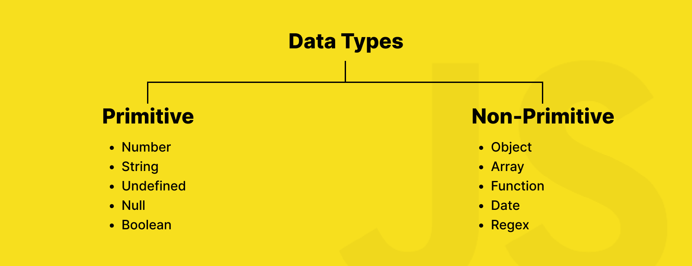
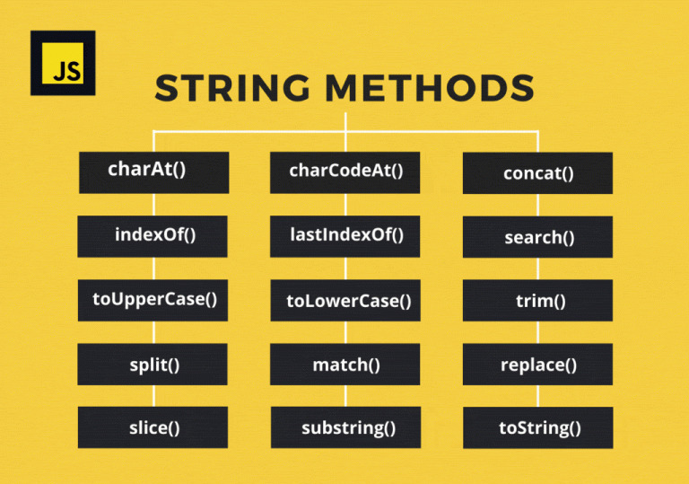
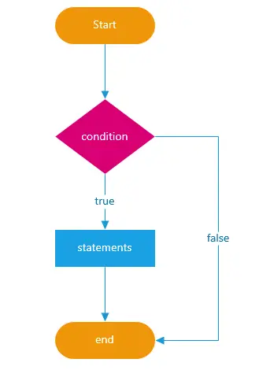

# Cuestiones teóricas

## 1. ¿Qué diferencia a Javascript de cualquier otro lenguaje de programación?


**Javascript** es un lenguaje de programación creado en 1995 por el programador estadounidense **Brendan Eich**. Este lenguaje de programación es único ya que puede ser **interpretado por los navegadores web** y se utiliza fundamentalmente para hacer que las páginas web sean interactivas y dinámicas. Constituye uno de los tres pilares del desarrollo web, junto con:

 - **HTML**, usado para la estructura de la página web.  
 - **CSS**, usado para el diseño y estilo de la página web. 
 - **JavaScript**, usado para agregar dinamicidad e interactividad a la página web.

Originariamente, JavaScript fue creado con el propósito de añadir interactividad y dinamicidad a las páginas web, tales como:

- Validación de formularios sin necesidad de recargar la página web. 
- Uso de menús desplegables.  
- Creación de sliders, carruseles o efectos visuales.  
- Carga de contenido sin recargar la página.
- Creación de juegos, animaciones y aplicaciones en el navegador.  

Actualmente también es posible usar Javascript fuera del navegador, utilizando alguna de las siguientes herramientas:

- **Node.js**: es un entorno de ejecución de JavaScript gratuito, de código abierto y multiplataforma que permite a los desarrolladores crear servidores, aplicaciones web, herramientas de línea de comandos y scripts.
- **React Native**: es un entorno de trabajo de JavaScript para crear aplicaciones reales nativas para iOS y Android, basado en la librearía de JavaScript React para la creación de componentes visuales.
- **Electron**: es un entorno de trabajo utilizado para crear aplicaciones de escritorio con JavaScript, HTML y CSS. 

Además de ser el único lenguaje de programación interpretado por los navegadores web, Javascript presenta otras características que lo hacen atractivo para el conjunto de los programadores: 

### Lenguaje interpretado 

A diferencia de otros lenguajes de programación como Fortran, Java o C++, que precisan de una compilación, Javascript se interpreta a tiempo real en los navegadores web.

### Tipado dinámico

Las variables de Javascript no tienen un tipo (véase la pregunta 2 de este documento) fijo, es decir, pueden cambiar de tipo en cualquier línea de código. Esto puede resultar práctico pero también una fuente de errores y no es del agrado de muchos desarrolladores. Un ejemplo de tipado dinámico es el siguiente:
```js
let fruta = 'melon'; // La variable fruta es una cadena.
console.log(fruta);
fruta = 27; // Ahora es un número entero.
console.log(fruta);
```
```
melon
27
```

### Basado en objetos y funciones

Javascript permite trabajar con objetos y funciones de forma flexible. Las funciones son ciudadanos de primera clase y se pueden usar funciones como variables así como pasarlas como argumentos. Por ejemplo, en el siguiente bloque de código se define la función `suma`:
```js
// Se define la función suma, que suma dos números.
function suma(num1, num2) {
  console.log(num1 + num2);
}

suma(5,3);
```
```
8
```
Un ejemplo de objeto en Javascript es el siguiente:
```js
const Coche = {
  Marca: 'Honda',
  Modelo: 'Accord',
  Potencia: 240,
};
```

### Multiparadigma

Javascript es un lenguaje de programación multi-paradigma, esto es, permite programar de forma **imperativa**, **funcional** así como **orientada a objetos**.

### Asincronía y eventos
La programación asíncrona es una técnica que permite a un programa iniciar una tarea de larga duración y seguir respondiendo a otros eventos mientras esa tarea es ejecutada, en lugar de tener que esperar hasta que haya finalizado. JavaScript puede ejecutar una tarea mientras espera otras, como cargar datos de un servidor sin bloquear la página. Para ello utiliza `setTimeout`, **promesas** así como `async/await`. En el siguiente bloque de código se muestra un ejemplo:
```js
async function obtenerDatosFinancieros() {
  const res = await fetch('https://api.investing.com');
  const datos = await res.json();
  console.log(datos);
}
```
En este código se define la función `obtenerDatosFinancieros`, que obtiene datos del precio de cotización de una acción a través de la API `https://api.investing.com` (inventada). Mientras este proceso no se complete no se ejecuta la siguiente línea de código, debido a la palabra `await`. Una vez recabados todos los datos, se ejecuta la siguiente línea de código, que utiliza el método `json` sobre la variable `res`, y finalmente se imprimen los datos obtenidos en pantalla.  

### Integración directa con HTML y CSS

JavaScript es el único lenguaje de programación que puede leer y modificar el contenido de una página en tiempo real (DOM). También puede cambiar estilos de CSS desde el código así como escuchar y reaccionar a eventos de los usuarios.

### Masivamente usado y respaldado por una comunidad enorme

Javascript es uno de los lenguajes de programación más populares del planeta. De acuerdo al índice TIOBE el 3.46% de todas las líneas de código escritas en este 2025 corresponden a Javascript y se sitúa en sexta posición. Tiene miles de frameworks y librerías como:
   
   -   **React**, **Vue**, **Angular**, ..., usadas para desarrollo frontend. 
   -   **Express**, **Next.js**, ..., usadas para desarrollo backend y SSR.
   -   **Electron**, **React Native**, ..., usadas para desarrollo de aplicaciones móviles y de escritorio.

Además, si se tiene alguna duda sobre un concepto o sobre cómo implementar una funcionalidad es muy probable que ya haya sido respondida por algún otro desarrollador en foros como Stack Overflow o Reddit.

## 2. ¿Cuáles son algunos tipos de datos JS?

Los tipos de datos de Javascript se clasifican en dos grandes categorías:

- **Primitivos**
- **No primitivos / Complejos / Estructurados**

Los **datos primitivos** son los tipos de datos más básicos y fundamentales. Son **inmutables**, esto es, no se pueden modificar directamente aunque sí se pueden reasignar. Estos tipos de datos no son objetos y carecen de métodos propios. A continuación se verá en detalle cada uno de los tipos de datos primitivos.

### String

El tipo de dato **string** se utiliza para almacenar cualquier cadena de texto. Existen tres formas diferentes de representar una cadena:

-   con comillas simples (`'`).
-   con comillas dobles (`"`).
-   con backticks (`).

En el siguiente ejemplo se puede ver una cadena con las diferentes representaciones:

```js
const fruta = "Tomate";
const fruta = 'Tomate';
const fruta = `Tomate`;
```
Pese a existir diferentes representaciones para las cadenas, aquellas no deben ser mezcladas.

La representación de cadenas usando "backticks" presenta una ventaja frente a las demás. Con esta representación se pueden interpolar cadenas, es decir, se puede ejecutar código de Javascript dentro de las mismas. Para ello, se debe encapsular el código dentro de corchetes precedidos por el signo del dólar `$`, `${<Inserte_Código_Aquí>}`. En el siguiente bloque de código se muestra un ejemplo de interpolación de cadenas:
```js
let  nombre  =  'Jorge';
const  saludo  =  `Hola ${nombre}`;
console.log(saludo);
```
```
Hola Jorge
```

### Number

El tipo `Number` es un valor en formato binario de 64 bits de doble precisión, por lo que puede representar números entre `-2^53-1` y `2^53-1`. Además de representar números de punto flotante, el tipo `Number` tiene tres valores simbólicos: `+Infinity`, `-Infinity` y `NaN` (Not A Number, por sus siglas en inglés).

### Boolean

El tipo de dato **boolean** solo admite dos valores: `true` o `false`. 
Este tipo de dato es muy usado en condicionales **if** o para comparar los valores de dos variables. Por ejemplo, en el siguiente bloque de código se comparan los valores de dos variables:
```js
let num1 = 10;
let num2 = 8;
let boolean = num1 < num2;
console.log(boolean);
```
```
false
```

### Undefined

El tipo de dato **undefined** se considera como valor de un dato o variable desconocido. Solo hay un valor con este tipo: `undefined`. Siempre que se crea una nueva variable, el primer valor que se le asigna a esa variable es `undefined`. Considere el siguiente ejemplo:
```js
let fruta;
console.log(fruta); 
```
```
undefined
```
A la variable `fruta` no se le ha asignado ningún valor, de manera que cuando se imprime en pantalla aparece el valor `undefined`.

###  Null

Este tipo de dato representa la ausencia intencionada de valor en una variable.

### Symbol

El tipo de dato **Symbol** se usa para crear valores únicos e inmutables. Estos se crean utilizando la palabra `Symbol` seguida de paréntesis. Cuando se crea una variable de este tipo su valor es único y solo ese valor sera igual a sí mismo. Aunque se cree otro símbolo a partir del mismo valor, estos no serán iguales. En el siguiente bloque de código se muestra un ejemplo:
```js
console.log(Symbol('melon') ===  Symbol('melon'));
console.log(Symbol(37) ===  Symbol(37));
console.log(Symbol() ===  Symbol());
```
```
false
false
false
```

### BigInt

El tipo de dato **BigInt** permite usar cualquier numero entero sin límite de tamaño, a diferencia del tipo **number**, que estaba limitado. Para poder definir un valor como tipo `bigint` se debe agregar una `n` al final del número que se desee. Sin embargo, este tipo de dato no se puede utilizar con métodos de la librería `Math` integrada y no se puede mezclar con datos de tipo `number` en operaciones.


Con esto se terminan los diferentes tipos de datos primitivos disponibles en Javascript. Por otro lado, existen los tipos de datos no primitivos / complejos / estructurados. Estos presentan estructuras que pueden almacenar múltiples valores, funciones o propiedades.  A continuación se describen en profundidad los tipos de datos no primitivos más usados.

### Object

El tipo de dato **Object** es el tipo en el que se basan casi todos los datos no primitivos.  
Un objeto es una colección de pares  de clave y valor. Las claves (o propiedades) son cadenas o símbolos mientras que los valores pueden ser de cualquier tipo (números, cadenas, funciones, otros objetos, etc). Por ejemplo, considere el siguiente bloque de código:
```js
const Coche = {
  Marca: 'Honda',
  Modelo: 'Accord',
  Potencia: 240,
};
```
Este código define el objeto `Coche` con las propiedades `Marca`, `Modelo` y `Potencia` y los valores `Honda`, `Accord` y `240` respectivamente. Los objetos son mutables, a diferencia de los datos primitivos, y se puede acceder a sus propiedades con `.` o `[]`, tal y como se muestra en el siguiente ejemplo:
```js
const Coche = {
  Marca: 'Honda',
  Modelo: 'Accord',
  Potencia: 240,
};
console.log(Coche.Marca);
console.log(Coche['Modelo']);
console.log(Coche.Potencia);
```
```
Honda
Accord
240
```

### Array

El tipo de dato **array** consiste en una lista ordenada de elementos, que pueden ser de cualquier tipo (números, cadenas, funciones, otros objetos, etc), indexados por número. Los arrays se representan entre corchetes y cada elemento está separado por una coma.
Para acceder a cualquiera de los elementos del array se debe escribir el nombre del array seguido de corchetes con el índice correspondiente al elemento al que se desea acceder. Considere el siguiente bloque de código de Javascript:
```js
const frutas = ["melon", "pera", "sandia"]; // Array
console.log(frutas[0]);
```
```
melon
```
Los arrays son una subclase del tipo object.  Además, pueden contener cualquier tipo de dato, incluso otros arrays u objetos, todos ellos mezclados. En el siguiente ejemplo se muestra un array mixto:
```js
const datos_personales = ["Jorge", 'Dominguez', true, 28, {clave_banco: "1234"}];
```
Los arrays tienen muchos métodos útiles definidos tales como `.push()`, `.pop()`, `.map()`, `.filter()`, etc.

### Function

Las **funciones** son objetos que albergan un bloque de código reutilizable que se puede ejecutar cuando se desee. Estas se pueden definir mediante una **declaración** o una **expresión** (la diferencia entre ambas definiciones se discute en la pregunta 6 de este mismo documento). Se pueden almacenar en variables, pasarlas como argumentos o devolverlas de otras funciones. Las funciones se utilizan para realizar cambios en alguna variable, calcular valores, etc. En el siguiente ejemplo se define una función mediante una declaración:
```js
function suma(num1, num2) {
	return num1 + num2
}
console.log(suma(5,8))
```
```
13
```

Aunque existen algunos otros tipos de datos no primitivos, los aquí expuestos son los más utilizados y no se discutirá ningún otro. A modo de resumen, en la siguiente figura se muestra un esquema con los distintos tipos de datos de Javascript, tanto primitivos como no primitivos, en aras de facilitar su aprendizaje.

 


## 3. ¿Cuáles son las tres funciones de String en JS?

Las **cadenas** o **strings** se utilizan para almacenar cadenas de texto. Estas se pueden representar de tres formas distintas: con comillas simples (`'`), comillas dobles (`"`) o backticks (`). Javascript provee muchas funciones útiles para trabajar y manipular cadenas. En la siguiente figura se muestran algunas de ellas, aunque hay muchas más.

 

A continuación se describirán de forma detallada algunas de la funciones predefinidas que tiene Javascript para trabajar con cadenas.

### .length

El método `.length` devuelve el número de caracteres de una cadena, incluyendo espacios, números, signos de puntuación así como símbolos. Por ejemplo,
```js
let texto = "Me llamo Jorge, tengo 28 años y me gusta andar en bici";
console.log(texto.length);
```
```
54
```

### .toUpperCase()

La función `.toUpperCase()` transforma el texto de la cadena a mayúsculas. Siguiendo con el ejemplo anterior,
```js
let texto = "Me llamo Jorge, tengo 28 años y me gusta andar en bici";
console.log(texto.toUpperCase());
```
```
ME LLAMO JORGE, TENGO 28 AÑOS Y ME GUSTA ANDAR EN BICI
```
Nótese que aquellas letras que ya estaban en mayúscula en la cadena inicial no cambian en la cadena transformada.

### .toLowerCase()

De manera análoga a la función anterior, la función `.toLowerCase()` transforma el texto de la cadena a minúsculas. Siguiendo con el ejemplo anterior,
```js
let texto = "Me llamo Jorge, tengo 28 años y me gusta andar en bici";
console.log(texto.toUpperCase());
```
```
me llamo Jorge, tengo 28 años y me gusta andar en bici
```
Nótese que aquellas letras que ya estaban en minúscula en la cadena inicial no cambian en la cadena transformada.

### .includes(substring)

La función `.includes(substring)` verifica si una cadena contiene la cadena que se le pasa como argumento y devuelve un booleano. Siguiendo con el ejemplo,
```js
let texto = "Me llamo Jorge, tengo 28 años y me gusta andar en bici";
console.log(texto.includes('bici'));
console.log(texto.includes('avion'));
```
```
true
false
```

### .indexOf(substring)

La función `.indexOf(substring)` devuelve el índice donde empieza una subcadena que se le pasa como argumento a la función. Si no la encuentra, devuelve `-1`. Por ejemplo,
```js
let texto = "Mis aficiones son la bici, el tenis y el baloncesto";
console.log(texto.indexOf('aficiones'));
```
```
4
```
Nótese que el índice en Javascript y otros lenguajes de programación empieza en cero y no en uno. Además, esta función también cuenta los espacios en blanco como un carácter.

### .slice(inicio, fin)

La función `.slice(inicio, fin)` extrae una parte de la cadena, concretamente la parte que se encuentra entre el índice `inicio` y el índice `fin` (sin incluir este último). Siguiendo con el ejemplo,
```js
let texto = "Mis aficiones son la bici, el tenis y el baloncesto";
console.log(texto.slice(18,));
```
```
la bici, el tenis y el baloncesto
```
Nótese que si uno de los argumentos que acepta la función no se pasa, la función devuelve la cadena desde el inicio hasta el índice que se pasa como fin (cuando el índice que falta es el primero) o desde el índice que se pasa como inicio hasta el final (cuando el índice que falta es el segundo). 

### .substring(inicio, fin)

La función `.substring(inicio, fin)` es análoga a la función `.slice(inicio, fin)`, pero no acepta números negativos.

### .replace(buscar, reemplazo)

La función `.replace(buscar, reemplazo)` reemplaza una parte de la cadena por otra, pero solo la primera coincidencia. Por ejemplo,
```js
let texto = "Mis aficiones son la bici, el tenis y el baloncesto";
console.log(texto.replace('tenis', 'futbol'));
```
```
Mis aficiones son la bici, el futbol y el baloncesto
```

### .trim()

La función `.trim()` elimina los espacios en blanco al inicio y al final de una cadena. Por ejemplo,
```js
let texto = "			Mi clave del banco es 1234						";
console.log(texto);
console.log(texto.trim());
```
```
			Mi clave del banco es 1234									
Mi clave del banco es 1234
``` 

### .split(separador)

La función `.split(separador)` divide la cadena en un array usando un separador. Volviendo a un ejemplo anterior,
```js
let texto = "Mis aficiones son la bici, el tenis y el baloncesto";
console.log(texto.split(','));
```
```
[ 'Mis aficiones son la bici', ' el tenis y el baloncesto' ]
```

### .charAt(posición)

La función `.charAt(posicion)` devuelve el carácter  ubicado en una posición específica de la cadena. Por ejemplo,
```js
let texto = "Mis aficiones son la bici, el tenis y el baloncesto";
console.log(texto.charAt(25));
```
```
,
```

### .startsWith() y .endsWith()

Las funciones `.startsWith()` y `.endsWith()` verifican si la cadena empieza o termina con un determinado texto que se pasa como argumento a estas funciones. Devuelven un booleano. Por ejemplo,
```js
let texto = "Mis aficiones son la bici, el tenis y el baloncesto";
console.log(texto.startsWith('Mis aficiones son'));
console.log(texto.endsWith('el tenis y el baloncesto'));
```
```
true
true
```

### .concat()

La función `.concat()` se utiliza para concatenar dos o más cadenas de texto y devolver una nueva cadena que resulta de esa combinación. Por ejemplo,
```js
let texto = "Mis aficiones son la bici, el tenis y el baloncesto";
console.log(texto.concat(' asi como el futbol'));

```
```
Mis aficiones son la bici, el tenis y el baloncesto asi como el futbol
```

Existen muchas más funciones disponibles en Javascript para trabajar con cadenas, pero por temas de espacio y tiempo no se pueden incorporar todas ellas a este documento y hay muchas que carecen de relevancia.

## 4. ¿Qué es un condicional?

Una estructura condicional o de tipo **if** es una estructura que permite condicionar la ejecución de un bloque de código al cumplimiento de una o varias condiciones impuestas por el programador.  En la siguiente figura se puede ver un diagrama de flujo de esta estructura.

 

De acuerdo a esta figura, se evalúa una condición. Si esta condición es verdadera o `true` se ejecuta el bloque de código. Si la condición no se cumple o es `false` puede ocurrir una de las siguientes cosas: se ignora el bloque de código, se ejecuta un bloque de código alternativo (`else`) o se evalúa otra condición (`else if`). 

En Javascript, esta estructura se define utilizando la palabra clave `if` seguida de una condición entre paréntesis `()`. El bloque de código que sigue debe estar encerrado entre llaves `{}`. En el siguiente bloque de código se puede ver un ejemplo del uso de esta estructura.

```js
const edad = 28;
if (edad > 18){
console.log('Tiene edad para sacarse el carné de conducir.');
}
```
```
Tiene edad para sacarse el carné de conducir.
```

Este programa define la variable `edad` y, si esta variable tiene un valor mayor de 18, el programa imprime una cadena. Como puede ver, se ha asignado a la variable `edad` el valor 28, de manera que se imprime la cadena `Tiene edad para sacarse el carné de conducir.`. Existe una variación de la estructura condicional `if`, la estructura `if-else if-else`, que permite ejecutar distintos bloques de código en función de la condición o condiciones que se cumplan. En el código que se muestra a continuación se recoge un ejemplo de esta variación.
```js
const edad = 17;
if (edad >= 16 && edad < 18) {
	console.log('Tiene edad para sacarse el carné de conducir de motos pero no de coches.');
} else if (edad >=18) {
	console.log('Tiene edad para sacarse el carné de conducir de coches y motos.');
} else {
	console.log('No puede conducir ningún vehículo a motor.');
}
```
```
Tiene edad para sacarse el carné de conducir de motos pero no de coches.
```
Este código define la variable `edad` y, en función de su valor, se imprimen distintas cadenas. Si su valor no cumple ninguna de las condiciones se ejecuta el bloque de código contenido en la palabra clave `else`, que imprime la cadena `'No puede conducir ningún vehículo a motor.'`. Si se cumple la condición de que sea mayor o igual a 18 se imprime en pantalla la cadena `'Tiene edad para sacarse el carné de conducir de coches y motos.'` y si se cumplen las condiciones de que sea mayor o igual a 16 y menor a 18 se imprime la cadena `'Tiene edad para sacarse el carné de conducir de motos pero no de coches.'`. En el caso del ejemplo se ha asignado a la variable `edad` el valor 17 y el programa nos dice que solo existe la posibilidad de conducir motos. Cabe destacar que es posible introducir más de una sentencia `else if` en la estructura condicional. Además, no es necesario utilizar las palabras `if`, `else if` y `else` de forma conjunta. Se puede utilizar la estructura `if-else` o la estructura `if-else if`.

## 5. ¿Qué es un operador ternario?

## 6. ¿Cuál es la diferencia entre una declaración de función y una expresión de función?

## 7. ¿Qué es la palabra clave "this" en JS?


