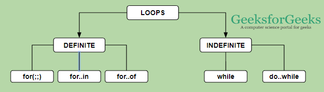
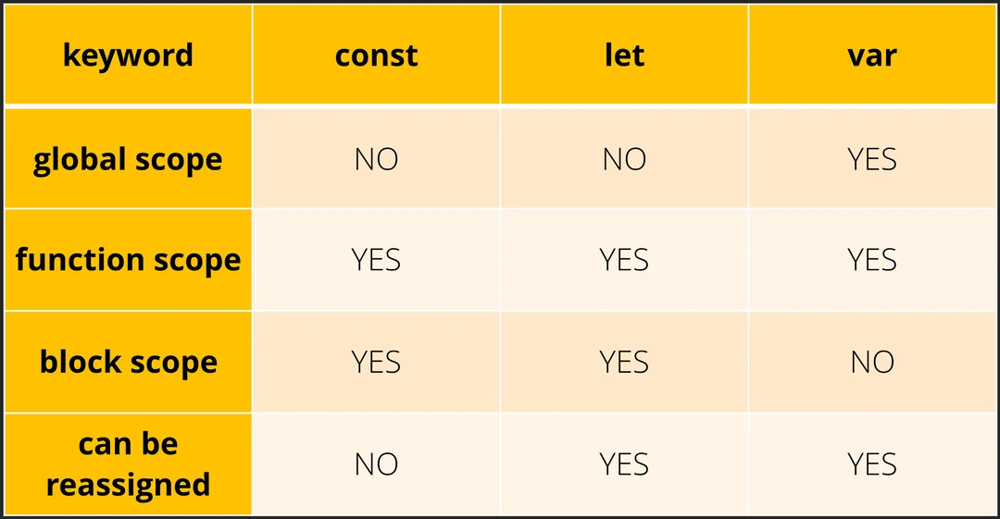
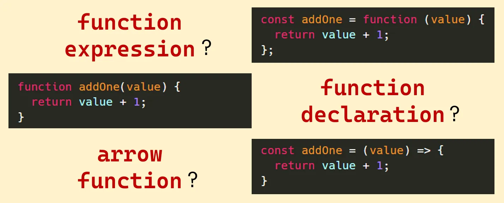
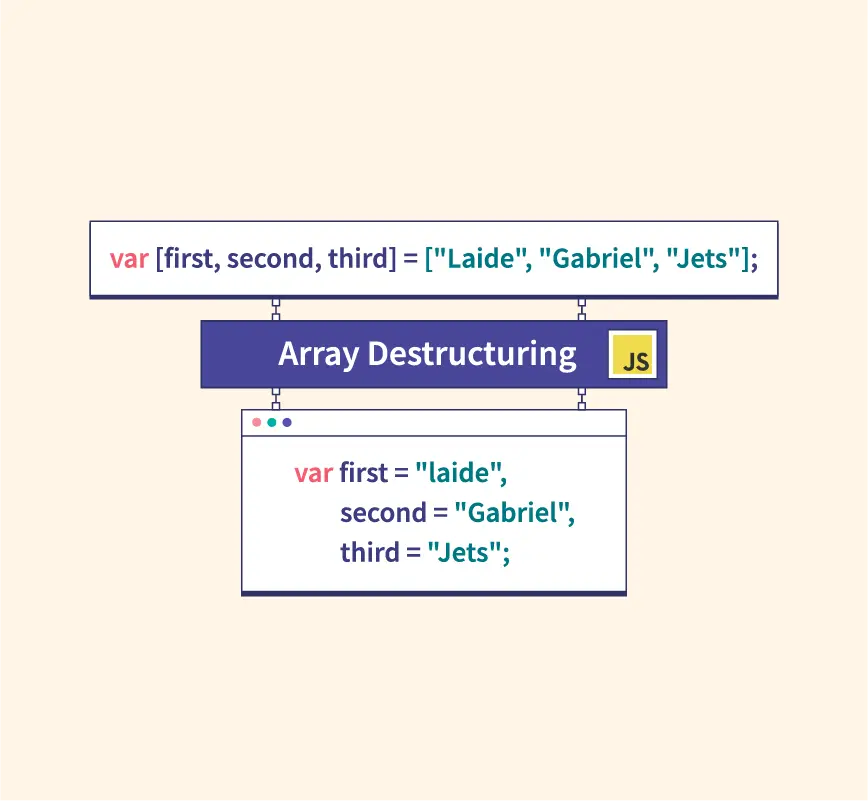
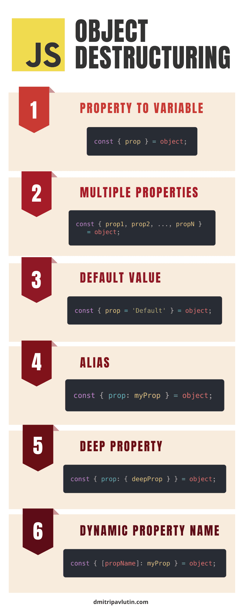
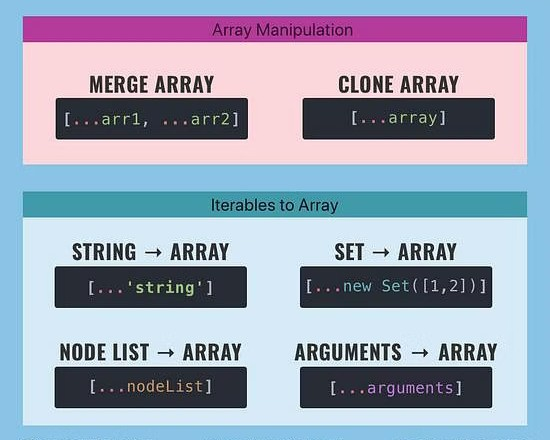
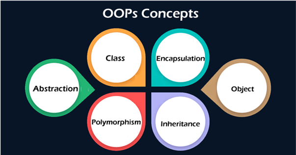

# Cuestiones teóricas

En esta wiki de GitHub se da respuesta a las cuestiones planteadas en el Checkpoint 8 del curso de desarrollador Full Stack de [Bottega - DevCamp](https://devcamp.es/bottega/).

## 1. ¿Qué tipo de bucles hay en JS?

Los bucles son estructuras que permiten iterar o repetir la ejecución de un bloque de código. En JavaScript se definen dos tipos principales de bucles: 

 - Los **bucles definidos** son aquellos que se usan cuando se conoce el número de veces que se desea iterar un bloque de código.
 - Los **bucles indefinidos**, por el contrario, se utilizan para repetir un bloque de código mientras se verifique una condición.

A continuación se estudian los distintos tipos de bucles contenidos en cada uno de los grupos.

### Bucle `for`

El bucle `for` es un bucle definido que se itera hasta que una condición determinada se evalúe como `false`. Un bucle `for` tiene el siguiente aspecto:

```js
for (expresiónInicial; expresiónCondicional; expresiónDeActualización) {
bloque de código
}
```
Este tipo de bucles se define con la palabra clave `for` seguida de paréntesis con tres expresiones separadas por punto y coma: una expresión que inicializa un contador y le asigna un valor, una expresión que impone una condición sobre el contador y una expresión sobre la forma en que se actualiza el valor del contador en cada iteración. Le siguen unas llaves `{}` con el bloque de código que se desea iterar.

Cuando se ejecuta un bucle `for`, ocurre lo siguiente:

1.  Se ejecuta la expresión de iniciación `expresiónInicial`, si existe. Esta expresión inicializa uno o más contadores, aunque se permite una expresión de cualquier grado de complejidad. Esta expresión también puede declarar variables.
2.  Se evalúa la expresión `expresiónCondicional`. Si el valor de `expresiónCondicional` es verdadero, se ejecutan las instrucciones del bucle. Si el valor de `condición` es falso, el bucle `for` termina.
3.  Se ejecuta el `bloque de código`.
4.  Si está presente, se ejecuta la expresión de actualización `expresiónDeActualización`.
5.  El control regresa al paso 2.

En la siguiente figura se muestra el diagrama de flujo de un bucle `for`:


A continuación se muestra un ejemplo de un bucle `for`:

```js
const listaCompra = [`peras`, `manzanas`,`plátanos`, `limones`, `melones`, `sandías`];
for (let i = 0; i < listaCompra.length; i++) {
	console.log(listaCompra[i]);
}
```
```
peras
manzanas
plátanos
limones
melones
sandías
```
En este bloque de código se ha definido el array `listaCompra`, que contiene 6 cadenas. El bucle `for` inicializa el contador `i` al que le asigna el valor 0 (`expresiónInicial`), define la condición de que `i` sea menor que la longitud del array `listaCompra` (`expresiónCondicional`) y después de cada iteración el valor de la variable `i` se actualiza sumándole una unidad (`expresiónDeActualización`). El bloque de código a iterar es `console.log(listaCompra[i])`, es decir, se desea imprimir en pantalla cada uno de los elementos del array `listaCompra`. 

### Bucle `while`

El bucle `while` es un bucle indefinido que se itera mientras una condición determinada se evalúe como `true`. Una instrucción `while` tiene el siguiente aspecto:

```js
while (condición)
  bloque de código
```
Si la `condición` se vuelve `false`, el `bloque de código` dentro del bucle se deja de ejecutar y el control pasa a la instrucción que sigue al bucle.

Cuando se ejecuta un bucle `while`, ocurre lo siguiente:
 
1.  Se evalúa la expresión `condición`. Si el valor de `condición` es `true`, se ejecutan las instrucciones del bucle. Si el valor de `condición` es falso, el bucle `while` termina.
2.  Se ejecuta el `bloque de código`.  
3.  El control regresa al paso 1.

Es importante mencionar que la prueba de la condición ocurre **antes** de que se ejecute el `bloque de código` en el bucle, a diferencia de lo que ocurre en los bucles `do-while`, en los que la `condición` se evalúa **después** de que se ejecute el `bloque de código`. Estos bucles se estudiarán posteriormente. 

En la siguiente figura se muestra el diagrama de flujo de un bucle `while`:


A continuación se muestra un ejemplo de un bucle `while`:

```js
const listaCompra = [`peras`, `manzanas`,`plátanos`, `limones`, `melones`, `sandías`];

let i = 0;
while (i < listaCompra.length) {
	console.log(listaCompra[i]);
}
```
```
peras
manzanas
plátanos
limones
melones
sandías
```
Este ejemplo es el mismo que se ha utilizado con los bucles `for`, pero reescrito con un bucle `while`. En este bloque de código se ha definido el array `listaCompra`, que contiene 6 cadenas. El bucle `while` define la condición de que `i` sea menor que la longitud del array `listaCompra`. El `bloque de código` a iterar es `console.log(listaCompra[i])`, es decir, se desea imprimir en pantalla cada uno de los elementos del array `listaCompra`. 

### Bucle `do-while`

El bucle `do-while` es muy parecido al bucle `while`. Es un bucle indefinido que se itera mientras una condición determinada se evalúe como `true`. Una instrucción `do-while` tiene el siguiente aspecto:

```js
do {
	bloque de código
} while (condición)
```
Este bucle garantiza que el `bloque de código` se ejecute al menos una vez. Si la `condición` se vuelve `false`, el `bloque de código` dentro del bucle se deja de ejecutar y el control pasa a la instrucción que sigue al bucle.

Cuando se ejecuta un bucle `do-while`, ocurre lo siguiente:
 
1.  Se ejecutan el `bloque de código`.
2. Se evalúa la expresión `condición`. Si el valor de `condición` es `true`, se ejecutan las instrucciones del bucle. Si el valor de `condición` es falso, el bucle `do-while` termina.
3.  El control regresa al paso 1.

En este caso la `condición` se evalúa **después** de que se ejecute el `bloque de código`.  

En la siguiente figura se muestra el diagrama de flujo de un bucle `do-while`:


A continuación se muestra un ejemplo de un bucle `do-while`:

```js
const listaCompra = [`peras`, `manzanas`,`plátanos`, `limones`, `melones`, `sandías`];

let i = 0;
do {
	console.log(listaCompra[i]);
} while (i < listaCompra.length)
```
```
peras
manzanas
plátanos
limones
melones
sandías
```
Este ejemplo es el mismo que se ha utilizado con los bucles `for` y `while`, pero reescrito con un bucle `do-while`. En este bloque de código se ha definido el array `listaCompra`, que contiene 6 cadenas. El bucle `do-while` define la condición de que `i` sea menor que la longitud del array `listaCompra`. El `bloque de código` a iterar es `console.log(listaCompra[i])`, es decir, se desea imprimir en pantalla cada uno de los elementos del array `listaCompra`. 

### Bucle `for-of`

El bucle `for-of` es un bucle definido utilizado para recorrer los valores de un objeto iterable como un array o una cadena. Una instrucción `for-of` tiene la siguiente sintaxis:

```js
for (variable of iterable) {
  bloque de código
}
```

Este tipo de bucles se define con la palabra clave `for` seguida de paréntesis con una variable que recorre los valores de un objeto iterable, la palabra clave `of` y el nombre del iterable. Le siguen unas llaves `{}` con el bloque de código a ejecutar en cada iteración.

Cuando se ejecuta un bucle `for-of`, ocurre lo siguiente:

1.  La variable `variable` toma el valor de un elemento del objeto iterable `iterable`.
2.  Se ejecuta el `bloque de código`.
3.  El control regresa al paso 1.

Cuando el objeto no tiene más elementos sobre los que iterar, el control pasa a la instrucción que sigue al bucle. El diagrama de flujo de un bucle `for-of` es análogo al de un bucle `for`. 

A continuación se muestra un ejemplo de un bucle `for-of`:

```js
const frutas = [`peras`, `manzanas`,`plátanos`, `limones`, `melones`, `sandías`];
for (let fruta of frutas) {
	console.log(fruta);
}
```
```
peras
manzanas
plátanos
limones
melones
sandías
```
En este bloque de código se ha definido el array `frutas`, que contiene 6 cadenas. El bucle `for-of` inicializa el iterable `fruta`, que recorre todos los valores del array `frutas` y los imprime en pantalla. 

### Bucle `for-in`

El bucle `for-in` es un bucle definido utilizado para iterar las propiedades de un objeto. Una instrucción `for-in` tiene el siguiente aspecto:

```js
for (clave in objeto) {  
	bloque de codigo  
}
```

Este tipo de bucles se define con la palabra clave `for` seguida de paréntesis con una variable que recorre los nombres de todas las propiedades del objeto, la palabra clave `in` y el nombre del objeto. Le siguen unas llaves `{}` con el bloque de código a ejecutar en cada iteración.

Cuando se ejecuta un bucle `for-in`, ocurre lo siguiente:

1.  La variable `clave` toma el nombre de una propiedad del objeto `objeto`.
2.  Se ejecuta el `bloque de código`.
3.  El control regresa al paso 1.

Cuando el objeto no tiene más propiedades sobre las que iterar, el control pasa a la instrucción que sigue al bucle. El diagrama de flujo de un bucle `for-in` es análogo al de un bucle `for`. 

A continuación se muestra un ejemplo de un bucle `for-in`:

```js
const  datosPersonales  = {
	nombre:  `Jorge`,
	apellido:  `Domínguez`,
	edad:  28,
	estudios:  `Universitarios`
};
for (let  clave  in  datosPersonales) {
	console.log(`${clave}: ${datosPersonales[clave]}`);
}
```
```
nombre: Jorge
apellido: Domínguez
edad: 28
estudios: Universitarios
```

En este ejemplo se recorren las propiedades del objeto `datosPersonales` y en cada iteración se imprime una cadena con el nombre de la propiedad y su valor.

Existen dos palabras clave que interrumpen el flujo normal de un bucle:

 - `break`
 - `continue`

La palabra clave `break` interrumpe la ejecución del bucle en el que se encuentra, y el control pasa a la instrucción que sigue al bucle, incluso si aún no se han terminado todas las iteraciones. Esto resulta útil cuando ya no se necesita seguir iterando, para salir anticipadamente si se cumple una condición o para buscar un valor y parar cuando se encuentra.

La palabra clave `continue` omite el resto del código de una iteración actual del bucle y pasa a la siguiente iteración. Esto resulta útil cuando se desean omitir ciertas iteraciones o cuando una condición hace que el resto del código no sea necesario.

A modo de resumen, en la siguiente figura se muestran los distintos tipos de bucles disponibles en Javascript.



## 2. ¿Cuáles son las diferencias entre const, let y var?

Las palabras clave `const`, `let` y `var` son tres formas distintas de declarar variables en Javascript. Estas se diferencian en varios aspectos:

 - **Ámbito o alcance** (en inglés, scope)
 - **Hoisting**
 - **Redeclaración y reasignación**

A continuación se va a profundizar en estas diferencias.

### Ámbito o alcance

El ámbito o alcance de una variable se define como el lugar del código donde esa variable es accesible. En Javascript existen tres tipos de ámbitos:

 - **Ámbito global**: las variables globales pueden ser accedidas desde cualquier parte del programa.
 - **Ámbito de función**: las variables con ámbito de función solo son accesibles dentro de la función en la que fueron declaradas. 
 - **Ámbito de bloque**: las variables con ámbito de bloque solo son accesibles dentro del bloque `{}` en el que fueron declaradas.

Dicho esto, una variable declarada con la palabra clave `var` tiene ámbito de función, es decir, solo existe dentro de la función donde fue declarada. Si se declara en un bloque (`if`, `for`, etc.),  esta es accesible desde fuera del bloque.

Por otro lado, las variables declaradas con las palabras clave `let` y `const` tienen ámbito de bloque, esto es, solo existen dentro del bloque `{}` donde fueron declaradas.

Para ilustrar esta diferencia considere el siguiente bloque de código:
```js
if (true) {
  var x = 28;
}
console.log(x);

if (true) {
  let y = 28;
}
console.log(y);
```
```
28
ReferenceError: y is not defined
```
Dentro del bloque del primer condicional `if` se ha declarado la variable `x` con la palabra clave `var`. Cuando se imprime en pantalla el valor de esta variable el resultado es 28, tal y como cabe esperar dado que la palabra clave `var` define variables accesibles desde fuera del bloque. Por otro lado, dentro del bloque del segundo condicional `if` se ha declarado la variable `y` con la palabra clave `let`. Cuando se imprime en pantalla el valor de esta variable el resultado es `ReferenceError: y is not defined`. Esto se debe a que la palabra clave `let` define variables con ámbito de bloque.

### Hoisting

El hoisting (que significa elevación) es un comportamiento de JavaScript en el que las declaraciones de variables y funciones se “mueven” al inicio de su ámbito antes de que se ejecute el código, es decir, es como si las variables y funciones se declararan al inicio del código, aunque se hayan escrito más abajo.

Dicho esto, todas las declaraciones se elevan al principio del ámbito. No obstante, las variables declaradas con  `var` se elevan con valor `undefined`, mientras que las variables declaradas con `let` y `const` se elevan pero no se pueden usar antes del punto en que se han declarado (`Reference error`). Esto último se conoce como **zona temporalmente muerta (TDZ)** y se define como la zona entre el comienzo del ámbito y la línea donde se declara la variable, donde no se puede acceder a la variable aunque esta esté hoisteada.

Para ilustrar esta diferencia considere el siguiente bloque de código:
```js
console.log(x); 
var x = 28;

console.log(y); 
const y = 28;
```
```
undefined
ReferenceError: Cannot access 'y' before initialization
```
En la primera línea de código se imprime en pantalla la variable `x`, que se define a continuación con la palabra clave `var`. En consecuencia, el valor que se imprime en pantalla es `undefined`, de acuerdo a lo que se ha explicado en esta sección. En la tercera línea de código se imprime en pantalla la variable `y`, que se define a continuación con la palabra clave `const`. En pantalla se imprime el error `ReferenceError: Cannot access 'y' before initialization`. Esto se debe a la zona temporalmente muerta de las declaraciones con `const` y `let`.

### Redeclaración y reasignación

La redeclaración de una variable consiste en volver a declararla con el mismo nombre y en el mismo ámbito. Las variables declaradas con `var` sí pueden ser redeclaradas, mientras que las variables declaradas con `const` y `let` no pueden ser redeclaradas.

Para ilustrar esta diferencia considere el siguiente bloque de código:
```js
var nombre = "Jorge";
console.log(nombre);
var nombre = "Ángel";
console.log(nombre);
```
```
Jorge
Ángel
```
Este código declara la variable `nombre` con la palabra clave `var` y le asigna el valor `Jorge`. Posteriormente se redeclara la misma variable y en el mismo ámbito y se le asigna el valor `Ángel`. Como puede ver, el código no produce errores y en cada impresión en pantalla se imprime el valor correcto de la variable.

Por otro lado, si se redeclara una variable declarada con la palabra clave `let` ocurre lo siguiente:
```js
let fruta = "Manzana";
console.log(fruta);
let fruta = "Plátano";
console.log(fruta);
```
```
SyntaxError: Identifier 'fruta' has already been declared
```
Se produce un error de sintaxis, ya que Javascript no permite redeclarar variables declaradas con `let` o `const`.

La reasignación de una variable consiste en cambiarle el valor a una variable ya declarada. Las variables declaradas con `var` y `let` sí pueden ser reasignadas, mientras que las variables declaradas con `const` no pueden ser reasignadas.

Para ilustrar esta diferencia considere el siguiente bloque de código:
```js
var nombre = "Jorge";
console.log(nombre);
nombre = "Ángel";
console.log(nombre);
```
```
Jorge
Ángel
```
Este código declara la variable `nombre` con la palabra clave `var` y le asigna el valor `Jorge`. Posteriormente se le asigna el valor `Ángel` a la misma variable. Como puede ver, el código no produce errores y en cada impresión en pantalla se imprime el valor correcto de la variable.

Por otro lado, si se realiza una reasignación a una variable declarada con la palabra clave `const` ocurre lo siguiente:
```js
const fruta = "Manzana";
console.log(fruta);
fruta = "Plátano";
console.log(fruta);
```
```
TypeError: Assignment to constant variable.
```
Se produce un error de tipo, ya que Javascript no permite reasignar variables declaradas `const`.

Estas son todas las diferencias que rodean a la delcaración de variables con las palabras clave `var`, `let` y `const`. Dicho esto, desde ES6 (2015), se **recomienda usar solo `let` y `const`**, ya que a declaración de variables con `var` tiene comportamientos confusos, no respeta el ámbito de bloque y puede causar errores sutiles.

A modo de resumen, a continuación se muestra una figura que contiene todas las diferencias entre `var`, `let` y `const`.



## 3. ¿Qué es una función de flecha?

Una **función** de Javascript es un bloque de código que se puede reutilizar y ejecuta una tarea determinada. Estas funciones, generalmente, toman argumentos de entrada. Los **argumentos** son información que entra en la función para producir una salida o resultado. En el siguiente bloque de código se muestra un ejemplo de función y los argumentos que toma como entrada.
```js
function  suma (num1, num2) {
return  num1 + num2
};
console.log(suma(5, 3));
```
```
8
```
Este bloque de código define la función `suma`, que toma como argumentos de entrada dos números cualesquiera `num_1` y `num_2` y devuelve la suma de ambos números. A modo de ejemplo, se ha impreso el resultado de sumar los números 5 y 3, dando el resultado de 8.

Dicho esto existen tres formas diferentes de crear una función en Javascript:
-  **Declaración de función**
-  **Expresión de función**
-  **Función flecha** (o arrow function)

A continuación se explicará en detalle cada uno de estos métodos para crear una función.

### Declaración de función

La **declaración** de una función es la forma clásica de crear una función. Esta empieza con la palabra clave `function` seguida del nombre que se le desea poner a la función y los paréntesis `()` con los argumentos que acepta. Le siguen llaves `{}` con el bloque de código que se desea incorporar a la función. En el siguiente ejemplo se muestra una declaración de función.

```js
function  saludo (nombre) {
return  `Hola ${nombre}`
};
console.log(saludo('Jorge'));
```
```
Hola Jorge
```

La función creada es `saludo`, que toma como argumento de entrada la cadena `nombre` y devuelve una cadena interpolada con un saludo. A modo de ejemplo, se ha llamado a la función con el argumento `nombre` con valor `'Jorge'` y el saludo que se imprime en pantalla es `Hola Jorge`.

### Expresión de función

La **expresión** de una función consiste en asignar una función anónima o nombrada a una variable. Esta empieza declarando la variable que contiene la función, seguida de un signo `=` y la palabra clave `function`. Esta palabra clave puede estar seguida del nombre de la función o puede ser anónima (sin nombre). Le siguen los paréntesis con los argumentos que acepta la función y llaves `{}` con el bloque de código que se desea incorporar a la función. En el siguiente ejemplo se muestra una expresión de función para la función declarada en el ejemplo precedente.

```js
const  saludo = function (nombre) {
return  `Hola ${nombre}`
};

console.log(saludo('Jorge'));
```
```
Hola Jorge
```

Aquí se ha creado la variable `saludo`, a la que se asigna una función anónima que toma como argumento de entrada la cadena `nombre` y devuelve una cadena interpolada con un saludo. A modo de ejemplo, se ha llamado a la variable `saludo` con el argumento `nombre` con valor `'Jorge'` y el saludo que se imprime en pantalla es `Hola Jorge`.

### Función flecha

La **función flecha** es una tercera forma de crear funciones en Javascript y actualmente es la más utilizada. Esta consiste en una **expresión de función** con una sintaxis más corta. Para crear una función flecha se empieza declarando la variable que contiene la función, seguida de un signo `=` y paréntesis `()` con los argumentos que acepta la función. Le sigue una flecha creada con un signo igual y un signo mayor o igual `=>` y llaves `{}` con el bloque de código que se desea incorporar a la función. En el siguiente ejemplo se muestra una expresión de función para la función con la que se ha trabajado en los ejemplos precedentes.

```js
const  saludo = (nombre) => {
return  `Hola ${nombre}`
};

console.log(saludo('Jorge'));
```
```
Hola Jorge
```

Aquí se ha creado la variable `saludo`, a la que se asigna una función anónima que toma como argumento de entrada la cadena `nombre` y devuelve una cadena interpolada con un saludo. A modo de ejemplo, se ha llamado a la variable `saludo` con el argumento `nombre` con valor `'Jorge'` y el saludo que se imprime en pantalla es `Hola Jorge`.

Las tres formas de crear una función no solo tienen diferencias sintácticas, sino también diferencias funcionales. Aquí se recogen las principales diferencias:

- La declaración de función siempre tiene nombre, mientras que la expresión de función puede ser anónima o ser nombrada.
- La declaración de función tiene **hoisting**, es decir, se puede llamar a la función antes de que esta haya sido creada. Por el contrario, la expresión de función no tiene hoisting y solo puede ser llamada después de haber sido creada.
- La declaración de función no forma parte de una asignación, mientras que la expresión de función sí.
- El comportamiento de la palabra clave `this` varía en función de la forma en que se define la función.

Este último punto es sumamente importante, de manera que se va a profundizar en él. La palabra clave `this` de Javascript significa "esto" en español y es muy utilizada dentro de funciones y clases debido a que tiene un valor flexible. Esta palabra es una referencia al contexto actual o al objeto desde el cual se está llamando una función. 

En la declaración de funciones el comportamiento de `this` depende de cómo se llama a la función. Si se llama directamente, `this` es el objeto global (`window` en navegador, `global` en Node.js), tal y como se ilustra en el siguiente bloque de código:

```js
function saludo() {
	console.log(this);
}
saludo();
```
```
<ref *1> Object [global] {
global: [Circular *1],
clearImmediate: [Function: clearImmediate],
setImmediate: [Function: setImmediate] {
[Symbol(nodejs.util.promisify.custom)]: [Getter]
},
clearInterval: [Function: clearInterval],
clearTimeout: [Function: clearTimeout],
setInterval: [Function: setInterval],
setTimeout: [Function: setTimeout] {
[Symbol(nodejs.util.promisify.custom)]: [Getter]
},
queueMicrotask: [Function: queueMicrotask],
structuredClone: [Getter/Setter],
atob: [Getter/Setter],
btoa: [Getter/Setter],
performance: [Getter/Setter],
fetch: [Function: fetch],
navigator: [Getter],
crypto: [Getter]
}
```  
Como la llamada a la función `saludo` se ha hecho directamente `this` es el objeto `global` en Node.js.

Si por el contrario se llama a la declaración de función desde un objeto, el comportamiento de `this` es el propio de los objetos. En el siguiente ejemplo se muestra este comportamiento:

```js
const datosPersonales = {
	nombre : 'Jorge',
	edad: 28,
	imprimir_datos: function() {
		console.log(`Hola, me llamo ${this.nombre} y tengo ${this.edad} años.`)
	}
};

datosPersonales.imprimir_datos();
```
```
Hola, me llamo Jorge y tengo 28 años.
```  
La variable `datosPersonales` define un objeto con tres atributos, `nombre`, `edad` e `imprimir_datos`. Aquí, la palabra clave `this` hace referencia a la variable `datosPersonales` debido a que es el objeto al que pertenece en este contexto. De esta manera, al hacer que la declaración de función `imprimir_datos` devuelva una cadena interpolada con los atributos `this.nombre` y `this.edad`, el código lo que realmente hará es devolver los atributos `datosPersonales.nombre` y `datosPersonales.edad`.

Por otro lado, la palabra `this` en las funciones flecha hereda el contexto de donde fueron definidas, no de donde se ejecutan. Por ejemplo,
```js
const datosPersonales = {
	nombre : 'Jorge',
	edad: 28,
	imprimir_datos: () => {
		console.log(`Hola, me llamo ${this.nombre} y tengo ${this.edad} años.`)
	}
};

datosPersonales.imprimir_datos();
```
```
Hola, me llamo undefined y tengo undefined años.
```  
Este ejemplo ya se ha utilizado antes con una declaración de función en vez de una función flecha. Nótese la diferencia de comportamiento de la palabra `this` cuando la función está declarada y cuando la función es una función flecha. En el primer caso se imprime la cadena `Hola, me llamo Jorge y tengo 28 años.` mientras que en el segundo se imprime `Hola, me llamo undefined y tengo undefined años.`.

A modo de resumen, en la siguiente figura se muestran las distintas formas de crear una función de Javascript.



## 4. ¿Qué es la deconstrucción de variables?

La deconstrucción de variables en Javascript es una forma de desempaquetar valores de arrays y objetos y asignarlos a variables en una sola línea. Existen fundamentalmente dos tipos de deconstrucción:

 - **Deconstrucción de arrays**
 - **Deconstrucción de objetos**

A continuación se estudian en detalle estos dos tipos de deconstrucción, su sintaxis y utilidad.

### Deconstrucción de arrays

En primer lugar conviene recordar qué es un array. Un **array** de Javascript consiste en una lista ordenada de elementos, que pueden ser de cualquier tipo (números, cadenas, funciones, otros objetos, etc), indexados por número. Los arrays se representan entre corchetes `[]` y cada elemento está separado por una coma.

Para acceder a cualquiera de los elementos del array se debe escribir el nombre del array seguido de corchetes con el índice correspondiente al elemento al que se desea acceder. El índice del primer elemento del array es el 0, el del segundo elemento el 1 y así sucesivamente. En el siguiente bloque de código se muestra un array y cómo se puede acceder a un elemento del mismo:
```js
const frutas = ["melon", "pera", "sandia"]; // Array
console.log(frutas[0]);
```
```
melon
```
Los arrays son una subclase del tipo object.  Además, pueden contener cualquier tipo de dato, incluso otros arrays u objetos, todos ellos mezclados. En el siguiente ejemplo se muestra un array mixto:
```js
const datos_personales = ["Jorge", 'Dominguez', true, 28, {clave_banco: "1234"}];
```
Los arrays tienen muchos métodos útiles definidos tales como `.push()`, `.pop()`, `.map()`, `.filter()`, etc.

Dicho esto, la **deconstrucción de arrays** es una forma rápida de extraer varios valores de un array y asignarlos a variables individuales, todo en una sola línea. La sintaxis básica es la siguiente:
```js
const [var1, var2, var3] = array;
```
siendo `var1`, `var2` y `var3` variables y `array` un array. Por ejemplo, considere el siguiente bloque de código:
```js
const frutas = [`pera`, `manzana`, `melón`];
const [a, b, c] = frutas;

console.log(a); 
console.log(b); 
console.log(c);
```
```
pera
manzana
melón
```
En este ejemplo se ha deconstruido el array `frutas` en las variables `a`, `b` y `c`.

En la deconstrucción de arrays **el orden es importante**, ya que los valores se asignan según el orden de los elementos en el array. Por ejemplo, cambiando los elementos del array `frutas` de orden,
```js
const frutas = [`pera`, `melón`, `manzana`];
const [a, b, c] = frutas;

console.log(a); 
console.log(b); 
console.log(c);
```
```
pera
melón
manzana
```
la asignación que se produce a cada una de las variables `a`, `b` y `c` es distinta.

Cuando se deconstruye un array se pueden **saltar elementos** (deconstrucción parcial) usando comas vacías. Esto es útil cuando se desea prescindir de algún elemento del array. Por ejemplo,
```js
const frutas = [`pera`, `melón`, `manzana`];
const [, , c] = frutas;

console.log(c);
```
```
manzana
```
En este caso se han saltado los dos primeros elementos del array.

En las deconstrucciones también se puede asignar un valor por defecto si el array no lo tiene:
```js
const frutas = [`manzana`];
const [a, b = 'plátano', c = 'sandía'] = frutas;

console.log(a);
console.log(b);
console.log(c);
```
```
manzana
plátano
sandía
```
En este caso el array `frutas` solo tiene un elemento, de manera que si se utiliza más de una variable en la deconstrucción hay que asignar valores por defecto o el valor será `undefined`.

Cuando solo se desea deconstruir una parte del array y los demás elementos se desean asignar a una única variable, se puede utilizar el operador **rest** (`...`). Por ejemplo,
```js
const frutas = [`manzana`, `pera`, `plátano`];
const [a, ...b] = frutas;

console.log(a);
console.log(b);
```
```
manzana
[ 'pera', 'plátano' ]
```
El primer elemento del array `frutas`, `manzana`, se asigna a la variable `a` y el resto de los elementos se asignan a la variable `b`.

También se puede usar la deconstrucción de arrays directamente en los argumentos de una función. Por ejemplo,
```js
function imprimirValores([val1, val2]) {
	return console.log(val1, val2);
}

imprimirValores([`Jorge`, `Domínguez`]);
``` 
```
Jorge Domínguez
```
Nótese que el argumento de entrada de la función `imprimirValores` es un array mientras que los valores impresos son las variables `val1` y `val2`.

Algunos casos en los que es múy útil la deconstrucción de arrays son **el intercambio de valores sin variable temporal** y **la extracción de valores de una función que devuelve un array**.

Para el intercambio de valores sin variable temporal se puede hacer lo siguiente:
```js
let val1 = 1;
let val2 = 2;
[val1, val2] = [val2, val1];

console.log(val1); 
console.log(val2); 
```
```
2
1
```
Inicialmente la variable `val1` tiene el valor 1 y la variable `val2` tiene el valor 2. Cuando se hace la deconstrucción del array la variable `val1` pasa a tener el valor 2 y la variable `val2` el valor 1.

Por otro lado, para la extracción de valores de una función que devuelve un array se puede hacer lo siguiente:
```js
function nombreCompleto(nombre, apellido) {
	return [nombre, apellido];
}

let [nombre, apellido] = nombreCompleto('Jorge', 'Domínguez');
console.log(nombre);
console.log(apellido);
```
```
Jorge
Domínguez
```

A modo de resumen, la siguiente figura muestra en qué consiste la deconstrucción de arrays:



### Deconstrucción de objetos

En primer lugar conviene recordar qué es un objeto. Un **objeto** de Javascript consiste en una colección de pares de llave y valor. Las llaves (o propiedades) son cadenas o símbolos mientras que los valores pueden ser de cualquier tipo (números, cadenas, funciones, otros objetos, etc). Por ejemplo, considere el siguiente bloque de código:
```js
const Coche = {
  Marca: 'Honda',
  Modelo: 'Accord',
  Potencia: 240,
};
```
Este código define el objeto `Coche` con las propiedades `Marca`, `Modelo` y `Potencia` y los valores `Honda`, `Accord` y `240` respectivamente. Los objetos son mutables y se puede acceder a sus propiedades con `.` o `[]`, tal y como se muestra en el siguiente ejemplo:
```js
const Coche = {
  Marca: 'Honda',
  Modelo: 'Accord',
  Potencia: 240,
};
console.log(Coche.Marca);
console.log(Coche['Modelo']);
console.log(Coche.Potencia);
```
```
Honda
Accord
240
```
Además, pueden contener cualquier tipo de dato, incluso otros arrays u objetos, todos ellos mezclados. En el siguiente ejemplo se muestra un objeto anidado dentro de otro objeto:
```js
const Coche = {
  Marca: 'Honda',
  Modelo: 'Accord',
  Potencia: 240,
  Propietarios: {
		prop1: 'Jorge Domínguez Becerril',
		prop2: 'Carlos Domínguez Becerril'
  }
};
```
Dicho esto, la **deconstrucción de objetos** es una forma rápida de extraer varios valores de un objeto y asignarlos a variables individuales, todo ello en una única línea. La sintaxis básica es la siguiente:
```js
const { propiedad1, propiedad2 } = objeto;
```
siendo `propiedad1` y `propiedad2` y `objeto` un objeto. Por ejemplo, considere el siguiente bloque de código:
```js
const coche = {
  marca: 'Honda',
  modelo: 'Accord',
  potencia: 240,
};

const { marca, modelo, potencia } = coche;
console.log(marca);
console.log(modelo);
console.log(potencia);
```
```
Honda
Accord
240
```
En este ejemplo se ha deconstruido el objeto `coche` en las variables `marca`, `modelo` y `potencia`.

En la deconstrucción de objetos **el nombre de la variable debe coincidir con la llave del objeto**. Sino se obtendrá el valor `undefined`. Por ejemplo,
```js
const coche = {
  marca: 'Honda',
  modelo: 'Accord',
  potencia: 240,
};

const { marca, modelo, pot } = coche;
console.log(marca);
console.log(modelo);
console.log(pot);
```
```
Honda
Accord
undefined
```
En este ejemplo se ha deconstruido el objeto `coche` en las variables `marca`, `modelo` y `pot`. Los nombre de las dos primeras variables, `marca` y `potencia`, coinciden con las propiedades del objeto `coche` y el valor que se les asigna es correcto. Sin embargo, la variable `pot` no coincide con el nombre de ninguna propiedad del objeto `coche` y el valor asignado a esa variable es `undefined`.

Cuando se deconstruye un objeto se pueden **renombrar las variables**, para guardar una propiedad en una variable con otro nombre. Por ejemplo:
```js
const coche = {
  marca: 'Honda',
  modelo: 'Accord',
  potencia: 240,
};

const { potencia: pot } = coche;
console.log(pot);
``` 
```
240
```
En este ejemplo la propiedad `potencia` se extrae del objeto y se guarda en la variable `pot`. 

En las deconstrucciones de objetos también se puede asignar un valor por defecto si el objeto no tiene una propiedad determinada:
```js
const coche = {
  marca: 'Honda',
  modelo: 'Accord',
  potencia: 240,
};

const { propietario = 'Jorge Domínguez Becerril' } = coche;
console.log(propietario);
```
```
Jorge Domínguez Becerril
```
En este caso el objeto `coche` no tiene la propiedad `propietario`, de manera que se le asigna el valor por defecto `Jorge Domínguez Becerril` a la variable `propietario`.

Cuando un objeto está anidado dentro de otro objeto se puede hacer una **deconstrucción anidada**. Por ejemplo,
```js
const coche = {
  marca: 'Honda',
  modelo: 'Accord',
  potencia: 240,
  propietarios: {
		prop1: 'Jorge Domínguez Becerril',
		prop2: 'Carlos Domínguez Becerril'
  }
};

const { propietarios: { prop2 }} = coche;
console.log(prop2);
```
```
Carlos Domínguez Becerril
```

Por último, ambién se puede usar la deconstrucción de objetos directamente en los argumentos de una función. Por ejemplo,
```js
const nombreCompleto = { 
	val1: 'Jorge',
	val2: `Domínguez`
};

function imprimirValores({ val1, val2 }) {
	return console.log(val1, val2);
}

imprimirValores(nombreCompleto);
``` 
```
Jorge Domínguez
```
Nótese que esto permite acceder directamente a las propiedades sin tener que escribir `nombreCompleto.val1`, `nombreCompleto.val2`, etc.

A modo de resumen, la siguiente figura muestra en qué consiste la deconstrucción de objetos:



## 5. ¿Qué hace el operador de extensión en JS?

El operador de extensión (o spread operator) en Javascript se usa para expandir o desempaquetar los elementos de un array, un objeto o cualquier otro elemento iterable. La sintaxis de este operador consiste en escribir tres puntos `...` delante de un iterable. Por ejemplo,
```js
...array
...objeto
...string
```
Este operador es ampliamente usado para realizar las siguientes operaciones:

 - **Copiar arrays**
 - **Combinar arrays**
 - **Pasar elementos de un array como argumentos**
 - **Copiar objetos**
 - **Combinar objetos**
 - **Extender cadenas en arrays**

A continuación se profundizará en cada uno de estos usos que recibe el operador de extensión.

### Copiar arrays

El siguiente bloque de código muestra un ejemplo sobre cómo copiar arrays:
```js
const original = ['Jorge', 'Domínguez', 'Becerril'];
const copia = [...original];

console.log(copia); 
```
```
[ 'Jorge', 'Domínguez', 'Becerril' ]
```
Esto crea una copia superficial (más adelante se explica qué es esto) del array. Resulta especialmente útil para evitar modificar el array original.

### Combinar arrays

El siguiente bloque de código muestra un ejemplo sobre cómo combinar arrays:
```js
const arr1 = ['plátano', 'manzana', 'pera'];
const arr2 = ['sandía', 'melón', 'kiwi'];

const arr_comb = [...arr1, ...arr2];
console.log(arr_comb);
```
```
[ 'plátano', 'manzana', 'pera', 'sandía', 'melón', 'kiwi' ]
```
Esta forma de combinar arrays resulta más limpia y clara que utilizar la función `concat()`.

### Pasar elementos de un array como argumentos

El siguiente bloque de código muestra un ejemplo sobre cómo pasar elementos de un array como argumentos de una función:
```js
function saludo(nombre, apellido) {
	console.log(`Buenos días ${nombre}  ${apellido}`);
}

const args = ['Jorge', 'Domínguez'];
saludo(...args);
```
```
Buenos días Jorge Domínguez
```
En lugar de pasar cada argumento de forma manual a la función, se pasa un array que contenga todos los argumentos y con el operador de extensión `...` se expande el array.

### Copiar objetos

En el siguiente bloque de código se muestra un ejemplo sobre cómo copiar objetos:
```js
const coche = {
  marca: 'Honda',
  modelo: 'Accord',
  potencia: 240,
};

const copia = { ...coche };
console.log(copia);
```
```
{ marca: 'Honda', modelo: 'Accord', potencia: 240 }
```
Al igual que con los arrays, esto hace una copia superficial.

### Combinar objetos

En el siguiente bloque de código se muestra un ejemplo sobre cómo combinar objetos:
```js
const coche = {
  marca: 'Honda',
  modelo: 'Accord'
};
const cocheanexo = {
	modelo: 'Civic',
	potencia: 240
};

const cochecomb = { ...coche, ...cocheanexo };
console.log(cochecomb);
```
```
{ marca: 'Honda', modelo: 'Civic', potencia: 240 }
```
Nótese que si en los objetos a combinar hay propiedades repetidas, la propiedad del objeto combinado adquiere el valor del último objeto que tiene esa propiedad. En el ejemplo `cocheanexo.modelo` reemplaza a `coche.modelo`.

### Extender cadenas en arrays

Por último, en el siguiente bloque de código se muestra un ejemplo sobre cómo extender cadenas en arrays:
```js
const documento = 'hola mundo';
const letras_doc = [...documento];

console.log(letras_doc);
```
```
[
'h', 'o', 'l', 'a',
' ', 'm', 'u', 'n',
'd', 'o'
]
```
La cadena se convierte en un array de caracteres.


Antes se ha mencionado que el operador de extensión realiza copias superficiales de arrays y objetos. Esto quiere decir que no clona objetos o arrays que estén anidados dentro del iterable que se desea copiar. El siguiente ejemplo ilustra este hecho:
```js
const coche = {
  marca: 'Honda',
  modelo: 'Accord',
  potencia: 240,
  propietarios: {prop1: `Jorge Domínguez Becerril`,
				 prop2: 'Carlos Domínguez Becerril'
  }
};

const copia = { ...coche };
console.log(copia);

copia.propietarios.prop1 = 'Ángel Domínguez Vera';
console.log(coche);
```
Como puede ver `propietarios` es un objeto anidado, y se copia por referencia, no por valor. Esto hace que cuando se modifica una propiedad de ese objeto en la variable `copia` esta modificación también se realiza en la variable original `coche`.

A modo de resumen, en la siguiente figura se muestran las distintas formas en que se puede utilizar el operador de extensión de Javascript.



## 6. ¿Qué es la programación orientada a objetos?

La programación orientada a objetos (POO) es un paradigma de programación basado en el uso de objetos. Estos objetos presentan atributos (o propiedades) y métodos, esto es, funciones que operan sobre los atributos, e interactúan entre sí para llevar a cabo las funcionalidades del programa.

En este paradigma son muy comunes los términos clase y objeto. Una **clase** es una estructura que permite definir objetos que poseen atributos y métodos, tal y como se puede ver en la imagen de arriba. Esta actúa como una plantilla para crear un objeto determinado, que es una **instancia** de esa clase. Las clases constituyen el núcleo de la programación orientada a objetos. 

Para ilustrar todos estos conceptos de la programación orientada a objetos considere el siguiente bloque de código de Javascript:
```js
class Cliente {
		constructor (nombre, apellido, deuda) {
			this.nombre = nombre
			this.apellido = apellido
			this.deuda = deuda
		}

		nueva_factura(cuantia_factura) {
	        this.deuda += cuantia_factura 
		}
};


let cliente1 = new Cliente('Jorge', 'Dominguez', 0);
console.log(cliente1.nombre);
console.log(cliente1.apellido);
console.log(cliente1.deuda);

cliente1.nueva_factura(500);
console.log(cliente1.deuda);
``` 
```
Jorge
Dominguez
0
500
```
Aquí se ha definido la clase `Cliente` con los atributos `nombre`, `apellido` y `deuda` y el método `nueva_factura`. Este método incrementa el atributo `deuda` de un cliente en la cantidad `cuantia_factura`. Luego se ha creado una instancia u objeto de la clase `Cliente`, concretamente `cliente1`, con los atributos `nombre` igual a `Jorge`, `apellido` igual a `Dominguez` y `deuda` igual a `0`. Finalmente se ha utilizado el método `nueva_factura` sobre el objeto `cliente1` para aumentar el atributo `deuda` en un valor de `500`.

Este ejemplo también es útil para ver la sintaxis utilizada en Javascript de la programación orientada a objetos. Para crear una clase se debe utilizar la palabra clave `class` seguida del nombre de la clase y unas llaves `{}`. Dentro de estas llaves es donde se definen los atributos de la clase así como los métodos. Para definir los atributos de la clase se utiliza la palabra clave `constructor` seguida de paréntesis con los nombres de los atributos separados por comas. Le siguen unas `{}` y se le asigna a cada atributo su valor correspondiente.

Para definir los métodos se escribe el nombre del método seguido de paréntesis con los nombres de los argumentos que toma el método. Le siguen unas llaves `{}` con las acciones que ejecuta el método. Para crear una instancia de una clase se define una variable y se utiliza la palabra clave `new` seguida del nombre de la clase y unos paréntesis con los valores que se quieren asignar a los atributos de la clase.

Para acceder a los atributos y métodos de una instancia simplemente se escribe el nombre de la instancia seguida de un punto `.` y el nombre del atributo o método al cual se desea acceder, tal y como se puede ver en las líneas `console.log()` del ejemplo. De la misma manera, también se pueden asignar nuevos valores a los atributos. A la hora de asignar un nombre a una clase suele ser una buena práctica utilizar la convención **Pascal Case**, es decir, la primera letra de cada palabra del nombre de la clase debe ir en mayúscula. Por otro lado, el nombre de las instancias debe ir en minúsculas. 

Algunos principios de la programación orientada a objetos son los siguientes:

- **Encapsulación**: se pueden agrupar datos y funciones relacionadas en una única clase.
- **Polimorfismo**: se pueden definir métodos con el mismo nombre pero con implementaciones diferentes en distintas clases.
- **Herencia**: se pueden crear nuevas clases basadas en clases existentes, favoreciendo la reutilización de código.

A continuación se estudian estos principios en detalle.

### Encapsulamiento

El **encapsulamiento** consiste en controlar el acceso a los datos. Desde ES2022 se puede usar el símbolo `#` para hacer atributos privados. En el siguiente bloque de código se muestra un ejemplo de encapsulamiento:
```js
class  Coche {
	#precio;
	
  constructor (marca, modelo, precio) {
		this.marca  =  marca;
		this.modelo  =  modelo;
		this.#precio  =  precio;
	}

	verPrecio() {
		return  this.#precio;
	}
};

let  coche1  =  new  Coche('Honda', 'Accord', 27000);
console.log(coche1.marca);
console.log(coche1.modelo);
console.log(coche1.#precio);
console.log(coche1.verPrecio());
```
```
Honda
Accord
undefined
27000
```
El atributo `#precio` no puede ser accedido directamente desde fuera de la clase utilizando el `.`. Para poder acceder a él es necesario utilizar el método `verPrecio()`.

### Herencia

La **herencia** es un principio de la programación orientada a objetos mediante el que se puede crear una clase hija partiendo de una clase padre que comparte sus métodos y atributos. En Javascript para especificar que una clase se hereda de otra se debe escribir la palabra clave `class` seguida del nombre de la clase hija, la palabra clave `extends` y el nombre de la clase padre. En esta clase hija se pueden definir nuevos métodos y atributos pero, además, se pueden sobrescribir métodos y atributos ya existentes, lo que da lugar al **polimorfismo** (véase el siguiente apartado de esta cuestión). En el siguiente bloque de código se muestra un ejemplo de herencia:
```js
// Clase padre
class Vehiculo {
    tipo() {
       return('Tengo un vehiculo');
    }
};
// Clases hija
class Coche extends Vehiculo {
    tipo() {
       return('Tengo un coche');
    }
};

class Moto extends Vehiculo {
    tipo() {
       return('Tengo una moto');
    }
};

class Autobus extends Vehiculo {
    tipo() {
       return('Tengo un autobús');
    }
};
```
En este ejemplo la clase padre es `Vehiculo` y las clases heredadas o hijas son `Coche`, `Moto` y `Autobus`.


### Polimorfismo

El polimorfismo está íntimamente relacionado con el principio de herencia. Un **polimorfismo** consiste en la implementación de un método de la clase padre en la clase hija con el mismo nombre pero con una acción distinta. Siguiendo con el ejemplo del apartado anterior:
```js
// Clase padre
class Vehiculo {
    tipo() {
       return('Tengo un vehiculo');
    }
};
// Clases hija
class Coche extends Vehiculo {
    tipo() {
       return('Tengo un coche');
    }
};

class Moto extends Vehiculo {
    tipo() {
       return('Tengo una moto');
    }
};

class Autobus extends Vehiculo {
    tipo() {
       return('Tengo un autobús');
    }
};

let coche1 = new Coche();
let moto1 = new Moto();
let autobus1 = new Autobus();

console.log(coche1.tipo());
console.log(moto1.tipo());
console.log(autobus1.tipo());
```
```
Tengo un coche
Tengo una moto
Tengo un autobús
```
Este código define la clase padre `Vehiculo` con el método `tipo`, que imprime una cadena en pantalla. Además, se definen las clases hija `Coche`, `Moto` y `Autobus`, que heredan los métodos y atributos de la clase `Vehiculo`. Nótese que en la definición de las clases hija se ha redefinido el método `tipo` imprimiendo para cada clase una cadena diferente. Esto es el polimorfismo, es decir, un método que imprime una cadena diferente en función de la clase hija aunque tenga el mismo nombre en todas las clases.

Las ventajas de usar la OOP en Javascript son las siguientes:

- Reutilización de código, debido al principio de **herencia**.
- Mejor organización (cada objeto tiene su lógica).
- Mayor facilidad de mantenimiento.
- Fácilmente escalable.    
- Útil en frameworks como React, Node.js, Angular, etc.

A modo de resumen, en la siguiente figura se muestran los conceptos y principios más importantes de la programación orientada a objetos.



## 7. ¿Qué es una promesa en JS?


## 8. ¿Qué hacen async y await por nosotros?

